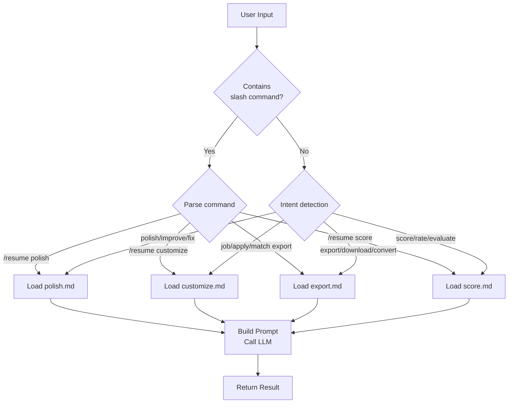

> AI-powered clawbot skill for resume & CV polishing, job customization, multi-format export, and professional scoring.
**Version:** 1.0.0 · **License:** MIT · **Repository:** [github.com/Wscats/resume-assistant](https://github.com/Wscats/resume-assistant)
## Overview
Resume / CV Assistant is a clawbot skill that helps job seekers create, refine, and optimize their resumes and CVs, while adding comprehensive checklist review, scoring, and multi-format export that neither project offers alone.

## Usage in AI Agent
### Quick Start
Resume / CV Assistant is a standard clawbot skill that can be loaded and invoked by any compatible AI Agent. Here are different integration approaches.

### 💬 Natural Language (Recommended)
You don't need to memorize any commands — simply describe what you need:

```
💬 "Create a resume for a software engineer position"
💬 "Polish my resume and fix any issues"
💬 "Optimize my resume for ATS"
💬 "Tailor my resume for this job description: [paste JD]"
💬 "Convert my resume to PDF"
💬 "Score my resume and tell me how to improve"
💬 "What's wrong with my resume?"
💬 "Here's my resume, can you help?"
```

The assistant understands your intent and automatically routes to the right workflow:

| You say | Assistant does |
|---------|---------------|
| "Create a resume for [role]" | Asks for your background → builds a tailored resume |
| "Polish / Fix / Improve my resume" | Runs 40+ checklist review → returns polished version |
| "Optimize for ATS" | Checks ATS compatibility → optimizes keywords & format |
| "Tailor for this JD: ..." | Analyzes JD → gap analysis → customized resume |
| "Convert to PDF / Word / ..." | Exports to chosen format with professional template |
| "Score / Rate / Evaluate my resume" | 100-point scoring → strengths & improvement plan |
| "Here's my resume, help?" | Scores first → suggests next steps |

#### 示例
**Creating a new resume:**
```
You:   Create a resume for a frontend engineer position at a startup

Bot:   I'd be happy to help! To get started, could you share:
       1. Your work experience (companies, roles, dates, key achievements)
       2. Education background
       3. Technical skills
       4. Any specific job posting you're targeting? (optional)

You:   I have 3 years at Shopify working on React...

Bot:   Here's your tailored resume:
       [generates complete resume]

       Would you like me to score, polish, or export it?
```

**Quick improvement:**
```
You:   Here's my resume, what do you think?
       [pastes resume]

Bot:   📊 Resume Score: 68/100 (Grade: C)
       Top 3 Issues:
       1. ❌ No quantified achievements
       2. ⚠️ Weak action verbs
       3. ⚠️ Missing keywords for target role

       Would you like me to polish it now?

You:   Yes, polish it

Bot:   [runs full polish with 40+ checklist items]
```

**Job-specific tailoring:**
```
You:   Tailor my resume for this job description:
       Senior Backend Engineer at Stripe
       Requirements: Go, distributed systems, payment APIs...

Bot:   🎯 Job Analysis Complete
       📊 Current Match: 62% → After Optimization: 89%
       [generates tailored version]
```

### Option 1: Slash Commands via clawbot
For more precise control, use slash commands directly in a clawbot conversation:

```
/resume polish
Please polish my resume:

John Doe
Senior Frontend Engineer | 5 years experience
Skills: JavaScript, React, Vue, Node.js
...
```

### Option 2: Integration in AI Agent Frameworks
#### 1. Register the Skill
Register this project as a skill in your AI Agent:

```json
{
  "skills": [
    {
      "name": "resume-assistant",
      "path": "./skills/resume-assistant",
      "manifest": "skill.json"
    }
  ]
}
```

#### 2. Load Prompts
When handling resume-related requests, prompt files are loaded in this order:

```
1. prompts/system.md      ← Persona & quality standards (loaded first)
2. prompts/<command>.md    ← Load per command: specific instructions
3. templates/<style>.md    ← Load on demand (export command only)
```

#### 3. Build the Complete Prompt
Example for `/resume polish` — here's how an AI Agent should construct the prompt:

```python
ROLE_SYS = "system"    # LLM message role constant
ROLE_USR = "user"      # LLM message role constant
def build_prompt(command, args):
    persona_prompt = load_file("prompts/system.md")

    command_prompt = load_file(f"prompts/{command}.md")

    combined = persona_prompt + "\n\n" + command_prompt
    messages = [
        {"role": ROLE_SYS, "content": combined},
        {"role": ROLE_USR, "content": args["resume_content"]}
    ]

    if args.get("language"):
        messages[1]["content"] += f"\n\nLanguage: {args['language']}"

    return messages
```

> 详细代码示例已移至 `references/detail.md`

### Option 3: REST API
If your AI Agent exposes an HTTP API, invoke via RESTful endpoints:

> 详细代码示例已移至 `references/detail.md`

### Option 4: LangChain / LlamaIndex Integration

> 详细代码示例已移至 `references/detail.md`

### Command Routing
The AI Agent should route user requests to the correct command:



### Argument Validation
The AI Agent should validate arguments before invocation, referencing `skill.json`:

> 详细代码示例已移至 `references/detail.md`

## Commands
### `/resume polish`
Run a **40+ item checklist** across 8 categories and get a fully improved resume.

**Arguments:**

| Name | Type | Required | Default | Description |
|------|------|----------|---------|-------------|
| `resume_content` | string | ✅ | — | Resume text (plain text or Markdown) |
| `language` | string | — | `en` | `en` for English, `zh` for Chinese |

**What you get:**
- ✅/❌/⚠️ checklist results for every item (contact, summary, experience, education, skills, grammar, formatting, ATS)
- Fully polished resume with strong action verbs and quantified results
- Change summary categorized by priority: 🔴 Critical → 🟡 Major → 🟢 Minor → 💡 Suggestion
- Action verb reference table and quantification guide

### `/resume customize`
Tailor your resume for a **specific job posting** with gap analysis and keyword optimization.

**Arguments:**

| Name | Type | Required | Default | Description |
|------|------|----------|---------|-------------|
| `resume_content` | string | ✅ | — | Resume text |
| `job_description` | string | ✅ | — | Target job description or job title |
| `language` | string | — | `en` | `en` for English, `zh` for Chinese |

**What you get:**
- Job description breakdown (required skills, preferred skills, responsibilities, keywords)
- Gap analysis matrix mapping every requirement to your resume
- Customized resume with keywords naturally integrated
- Keyword coverage report: before vs. after
- Bonus: cover letter talking points + interview prep notes

### `/resume export`
Convert your resume to **Word, Markdown, HTML, LaTeX, or PDF** with professional templates.

**Arguments:**

| Name | Type | Required | Default | Description |
|------|------|----------|---------|-------------|
| `resume_content` | string | ✅ | — | Resume text (Markdown preferred) |
| `format` | string | ✅ | — | `word` \| `markdown` \| `html` \| `latex` \| `pdf` |
| `template` | string | — | `professional` | `professional` \| `modern` \| `minimal` \| `academic` |

**Templates:**

| Template | Style | Best For |
|----------|-------|----------|
| `professional` | Navy, serif headings, classic borders | Finance, consulting, law, healthcare |
| `modern` | Teal accents, creative layout, emoji icons | Tech, startups, product, marketing |
| `minimal` | Monochrome, ultra-clean, content-dense | Senior professionals, engineering |
| `academic` | Formal serif, multi-page, publications | Faculty, research, PhD applications |

**Export details:**
- **HTML**: Self-contained file with embedded CSS, 4 color themes, `@media print` optimized
- **LaTeX**: Complete compilable `.tex` with XeLaTeX + CJK support
- **Word**: Pandoc-optimized Markdown with YAML front matter + conversion command
- **PDF**: Print-optimized HTML with A4 page dimensions + multiple conversion methods
- **Markdown**: Clean, structured, version-control friendly

### `/resume score`
Get a **100-point professional evaluation** with specific improvement suggestions.

**Arguments:**

| Name | Type | Required | Default | Description |
|------|------|----------|---------|-------------|
| `resume_content` | string | ✅ | — | Resume text |
| `target_role` | string | — | — | Target role for fit assessment |
| `language` | string | — | `en` | `en` for English, `zh` for Chinese |

**Scoring dimensions (100 points):**

| Dimension | Points | Evaluates |
|-----------|--------|-----------|
| Content Quality | 30 | Achievements, action verbs, relevance, completeness |
| Structure & Formatting | 25 | Layout, consistency, length, section order |
| Language & Grammar | 20 | Grammar, spelling, tone, clarity |
| ATS Optimization | 15 | Keywords, standard headings, format compatibility |
| Impact & Impression | 10 | 6-second test, career story, professionalism |

**Grade scale:** A+ (95-100) → A (90-94) → B+ (85-89) → B (80-84) → C+ (75-79) → C (70-74) → D (60-69) → F (<60)

**What you get:**
- Score breakdown with per-dimension justification
- Top 3 strengths with specific examples from your resume
- Priority-ranked improvements with **Before → After** rewrites
- Role fit assessment (if target_role provided): fit score, competitive percentile, strengths, gaps
- 5-step action plan with effort estimates

## Recommended Workflow

> 详细代码示例已移至 `references/detail.md`

**Tips:**
1. Start with **score** if you have an existing resume — understand your baseline
2. **Polish** to fix all fundamentals before customizing for a job
3. **Customize** separately for each application — one-size-fits-all doesn't work
4. **Export** last — get content perfect, then format
5. Use **Markdown** as your working format — it converts cleanly to all others
6. **Score again** after polish + customize to measure improvement

## Project Structure

> 详细代码示例已移至 `references/detail.md`

## Language Support
| Language | Code | Features |
|----------|------|----------|
| English | `en` | Full support, US/UK conventions |
| Chinese | `zh` | Full support, 中英文混排规范, CJK export |

## Configuration
| Key | Value | Description |
|-----|-------|-------------|
| `max_resume_length` | 10,000 chars | Maximum input length |
| `supported_languages` | `en`, `zh` | Available languages |
| `supported_export_formats` | word, markdown, html, latex, pdf | Available export formats |
scats

## 依赖说明
### 运行环境
- **Agent平台**: 支持SKILL.md的任意AI Agent(Claude Code / Cursor / Codex / Gemini CLI等)
- **操作系统**: Windows / macOS / Linux

### 依赖说明
| 依赖项 | 类型 | 是否必需 | 获取方式 |
|:-------|:-----|:---------|:---------|
| LLM API | API | 必需 | 由Agent内置LLM提供 |

### API Key 配置
- 本Skill基于Markdown指令,无需额外API Key(除内容中明确标注的外部API)

### 可用性分类
- **分类**: MD+EXEC(纯Markdown指令,部分功能需要exec命令行执行能力)
- **说明**: 基于Markdown的AI Skill,通过自然语言指令驱动Agent执行任务

## 核心能力
Resume / CV Assistant is a clawbot skill that helps job seekers create, refine, and optimize their resumes and CVs, while adding comprehensive checklist review, scoring, and multi-format export that neither project offers alone.

## 适用场景
| 场景 | 输入 | 输出 |
|------|------|------|
| 基础使用 | 用户请求 | 处理结果 |

**不适用于**：需要人工判断的复杂决策场景

## 错误处理
| 错误场景 | 原因 | 处理方式 |
|---------|------|---------|
| 配置错误 | 参数缺失或格式错误 | 检查依赖说明中的配置要求 |
| 运行时错误 | 运行环境不满足 | 确认运行环境符合依赖说明 |
| 网络错误 | 连接超时或不可达 | 检查网络连接后重试，参考国内替代方案 |

## 常见问题
### Q1: 如何开始使用Resume Assistant？
A: 请先阅读使用流程章节，确认环境满足依赖说明中的要求。

### Q2: 遇到错误怎么办？
A: 请参考错误处理章节，按照表格中的处理方式操作。

### Q3: Resume Assistant有什么限制？
A: 请参考已知限制章节了解具体限制。

## 已知限制
- 需要LLM支持，无LLM环境无法使用
- 复杂场景可能需要人工辅助判断
- 性能取决于底层模型能力
