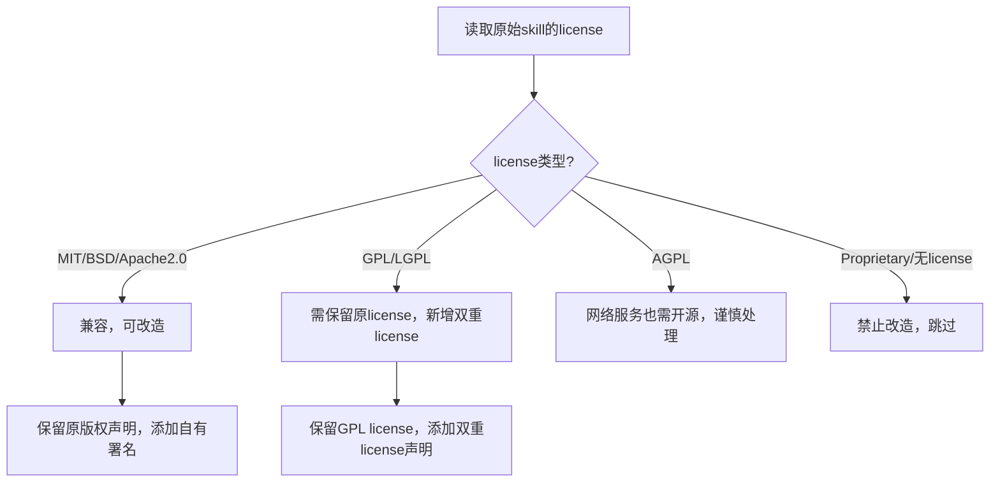
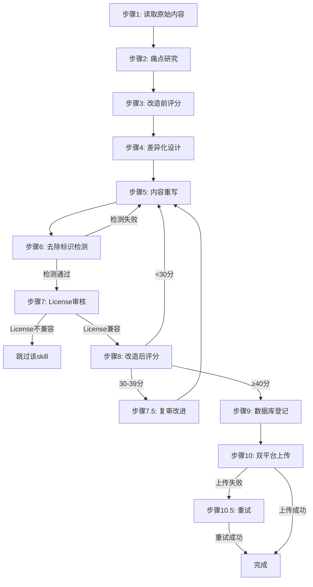

# Skill生产规范 v1.2（Skill Production Standards）

本规范是所有Skill生产、优化、升级、改造的**唯一权威标准**。任何Skill在进入`d:\skills\differentiated-skills\`或`d:\skills\packaged-skills\`之前，必须通过本规范的全部检查。

> **v1.2变更说明**：经第二轮五角色交叉审核，修复9项P0问题。主要变更：(1) 修复`\b`正则在中文上下文失效（改用ASCII-only lookarounds `(?<![A-Za-z0-9_])(?![A-Za-z0-9_])`）；(2) 数据库新增edition/parent_slug/current_score/workflow_state字段；(3) 新增scores表持久化八大维度评分；(4) 新增workflow_states表追踪10步工作流；(5) 修复License违规（规范要求保留原作者版权声明）；(6) 清除所有硬编码API Token；(7) 完善ALLOWED_CONTEXTS。

> **v1.1变更说明**：经五轮多角色交叉审核（质量工程师/架构师/产品经理/开发者/安全合规），修复20项P0问题。主要变更：评分制改为0/2/4/6分制；使用edition字段替代后缀；区分自动化与人工检测；添加License审核；添加不达标回流机制；技术术语allowlist。

## 一、八大改造维度（量化评分）

每个Skill改造后，按以下八大维度评分。每维度采用**0/2/4/6分制**（0=缺失，2=不足，4=合格，6=优秀），总分48分。

### 评分门槛
- **≥40分**：通过，可上架
- **30-39分**：需复审，改进后可上架
- **<30分**：不通过，必须返工

> **设计理由**：0/2/4/6分制相比0/3/5分制，避免"全3分=24分不过，5×5+3×0=25分过"的激励扭曲问题。

### 维度1：质量（Quality）- 6分制

| 评分项 | 0分（缺失） | 2分（不足） | 4分（合格） | 6分（优秀） |
|--------|-------------|-------------|-------------|-------------|
| 边界情况处理 | 无 | 覆盖主要边界 | 覆盖全部边界 | 边界+异常+极端情况 |
| 错误代码与恢复 | 无 | 有错误说明 | 错误代码+恢复策略 | 错误代码+恢复+重试+熔断 |
| 真实使用示例 | 无 | 1-2个简单示例 | 3+个真实场景 | 3+场景+不同角色视角 |
| 参数说明完整性 | 缺失 | 主要参数有说明 | 全参数+类型 | 全参数+类型+限制+默认值+示例 |

**检查清单**：
- [ ] 所有API端点/命令参数是否标注类型、必填、默认值
- [ ] 是否覆盖空输入、超大输入、非法输入的处理
- [ ] 是否提供HTTP错误代码与恢复策略
- [ ] 是否有3+个真实场景示例（非hello world）

### 维度2：实用性（Practicality）- 6分制

| 评分项 | 0分 | 2分 | 4分 | 6分 |
|--------|-----|-----|-----|-----|
| 痛点针对性 | 无痛点研究 | 有痛点但泛泛 | 痛点+明确对策 | 痛点+量化对策+效果指标 |
| 场景化指南 | 无 | 1个场景 | 3+场景按角色 | 3+角色×3+场景+对比 |
| FAQ与故障排查 | 无 | 简单FAQ | FAQ(≥5)+排查表(≥5) | FAQ+排查表+解决步骤+优先级 |
| 高频功能覆盖 | 基础功能 | 核心功能 | 核心+高级 | 核心+高级+边缘+自定义 |

**检查清单**：
- [ ] 是否研究用户痛点（WebSearch+评论分析）
- [ ] 是否针对每个痛点设计明确对策
- [ ] 是否按用户角色（开发者/运维/产品/运营）提供场景指南
- [ ] 是否包含FAQ（≥5问）和故障排查表（≥5项）

### 维度3：易用性（Simplicity）- 6分制

| 评分项 | 0分 | 2分 | 4分 | 6分 |
|--------|-----|-----|-----|-----|
| 快速开始章节 | 无 | 有但冗长 | <120秒上手 | <60秒上手+可复制模板 |
| 文档分层 | 无 | 2层 | 3层（快速/标准/高级）| 3层+按需加载 |
| 指令精简度 | 冗长 | 适中 | 表格化 | 表格化+模板化+变量引用 |

> **快速开始时间分级**：简单工具<60秒，中等工具<120秒，复杂工具<300秒。不搞一刀切。

### 维度4：LLM成本（Cost）- 6分制

| 评分项 | 0分 | 2分 | 4分 | 6分 |
|--------|-----|-----|-----|-----|
| Token压缩 | 无 | 压缩部分 | 压缩30%+ | 压缩40%+ |
| 按需加载 | 全量加载 | 部分分层 | references分层 | 分层+懒加载+预取 |
| 缓存策略 | 无 | 简单缓存 | 多级缓存 | 多级缓存+命中率指标 |
| 模型路由 | 无 | 固定模型 | 按复杂度路由 | 路由+成本预估+预算控制 |

**检查清单**：
- [ ] 是否压缩重复说明（合并相似指令）
- [ ] 是否使用references分层按需加载
- [ ] 是否提供token用量预估
- [ ] 是否设计缓存策略（结果复用、批量请求）

### 维度5：性能（Performance）- 6分制

| 评分项 | 0分 | 2分 | 4分 | 6分 |
|--------|-----|-----|-----|-----|
| 并行化 | 全串行 | 部分并行 | 依赖图+并行 | 自动并行+负载均衡 |
| 批处理 | 无 | 简单批处理 | 批量+检查点 | 批量+检查点+恢复+幂等 |
| 增量更新 | 无 | 全量更新 | 增量更新 | 增量+版本对比+回滚 |

### 维度6：去除标识（Debranding）- 6分制

| 评分项 | 0分 | 2分 | 4分 | 6分 |
|--------|-----|-----|-----|-----|
| 自动化检测通过率 | <50% | 50-80% | 80-95% | 95%+ |
| 人工检查通过率 | <50% | 50-80% | 80-95% | 95%+ |
| 技术术语处理 | 误删合法术语 | 部分误删 | allowlist机制 | allowlist+上下文感知 |

**检查清单**：见第三章"去除标识检测体系"。

### 维度7：合规性（Compliance）- 6分制

| 评分项 | 0分 | 2分 | 4分 | 6分 |
|--------|-----|-----|-----|-----|
| frontmatter完整性 | 缺字段 | 主要字段有 | 全字段+格式正确 | 全字段+格式+校验脚本 |
| 依赖说明章节 | 无 | 有但简略 | 完整4部分 | 4部分+版本兼容性 |
| 双平台适配 | 无 | 单平台 | 双平台基本适配 | 双平台+差异处理+冲突预案 |
| License合规 | 未审核 | 简单标注 | 审核+保留声明 | 审核+保留+兼容性分析 |

### 维度8：差异化（Differentiation）- 6分制

| 评分项 | 0分 | 2分 | 4分 | 6分 |
|--------|-----|-----|-----|-----|
| 功能差异化 | 无 | 小幅增强 | 2+独有功能 | 3+独有功能+对比表 |
| 内容原创度 | <30% | 30-50% | 50-70% | >70%原创 |
| 痛点对策深度 | 无 | 1-2个对策 | 3+个对策 | 3+对策+效果量化 |

## 二、免费/收费双版本生成规范

### 2.1 版本命名规则（符合SemVer）

> **重要变更**：v1.1不再使用`-pro`/`-free`后缀（违反SemVer），改用`edition`字段区分。

```yaml
# 免费体验版
slug: my-skill-free      # slug加-free后缀区分
version: "1.0.0"          # 版本号符合SemVer，无后缀
edition: free             # 使用edition字段标记

# 收费专业版
slug: my-skill-pro        # slug加-pro后缀区分
version: "1.0.0"
edition: pro
```

> **设计理由**：
> 1. slug层面区分（`-free`/`-pro`）确保两个版本在平台上是独立skill
> 2. version字段严格符合SemVer（major.minor.patch）
> 3. edition字段用于数据库追踪关联（两版本共享parent_slug）

### 2.2 免费体验版规范

**目标**：让用户体验核心价值，**不限制使用次数**，仅限制高级功能。

**必须包含**：
- 核心功能（让用户能完成基本任务）
- 快速开始（按复杂度分级：<60s/<120s/<300s）
- 基础FAQ（3-5问）
- 基础示例（1-2个）

**必须限制**（在SKILL.md末尾标注）：
```markdown
## 免费版限制

本免费体验版限制以下高级功能：
- ❌ [高级功能1]（如：批量处理 > 10条）
- ❌ [高级功能2]（如：高级缓存策略）
- ❌ [高级功能3]（如：自定义模板）

解锁全部功能请使用专业版：[slug]-pro
```

**禁止**：
- ❌ 限制使用次数（如"每天3次"）—— **设计理由**：损害用户体验，降低转化率
- ❌ 限制文件大小（如"<1MB"）—— **设计理由**：技术限制无商业意义
- ❌ 添加水印或广告 —— **设计理由**：降低专业感
- ❌ 强制注册/登录 —— **设计理由**：增加摩擦

> **LLM成本控制**：免费版应使用低成本模型路由（如GPT-4o-mini），避免平台亏损。

### 2.3 收费专业版规范

**目标**：提供完整功能+高级特性+优先支持。

**必须包含**（在免费版基础上新增）：
- 全部高级功能（无限制）
- 高级场景指南（3+角色×3+场景）
- 完整FAQ（10+问）+ 故障排查表
- 性能优化策略（缓存/并行/批处理）
- 多平台集成示例
- 版本升级迁移指南

**必须包含**（新增章节）：
```markdown
## 专业版特性

本专业版相比免费版新增以下能力：
- ✅ [高级功能1]：[价值描述]
- ✅ [高级功能2]：[价值描述]
- ✅ [高级功能3]：[价值描述]

## 定价

| 版本 | 价格 | 功能 | 适用场景 |
|------|------|------|----------|
| 免费体验版 | ¥0 | 核心功能+基础示例 | 个人试用 |
| 收费专业版 | ¥[XX]/月 | 全功能+高级特性+优先支持 | 团队/企业 |

专业版通过SkillHub SkillPay发布。
```

### 2.4 收费定价策略

| Skill类型 | 定价建议 | 理由 | 免费版模型路由 |
|-----------|----------|------|----------------|
| 基础工具（单功能） | ¥9.9/月 或 ¥99一次性 | 低门槛，走量 | GPT-4o-mini |
| 专业工具（多功能） | ¥29.9/月 | 平衡价值与门槛 | GPT-4o-mini |
| 企业工具（团队用） | ¥99/月 或 ¥999一次性 | 高价值，按团队 | GPT-4o |
| 行业工具（垂直领域） | ¥49.9/月 | 垂直溢价 | GPT-4o-mini |
| 数据分析（决策型） | ¥199/月 | 高溢价，决策价值 | GPT-4o |
| 创意工具（内容生产） | ¥19.9/月 | 创作者付费意愿高 | GPT-4o-mini |

### 2.5 双平台发布策略（修复商业模式矛盾）

> **v1.1重要变更**：修复"clawhub上传专业版但无定价机制"的矛盾。

| 平台 | 上传版本 | 定价机制 | 理由 |
|------|----------|----------|------|
| clawhub | **免费体验版** | 无定价 | clawhub无SkillPay，上传免费版引流 |
| skillhub | **收费专业版** | SkillPay定价 | skillhub支持付费，上传专业版变现 |

> **设计理由**：clawhub作为引流渠道（免费版），skillhub作为变现渠道（专业版）。避免"专业版在clawhub免费分发"的商业模式矛盾。

## 三、去除标识检测体系

### 3.1 自动化检测（6项，正则表达式）

> **v1.1变更**：明确区分"自动化检测6项"和"人工检查9项"，不再声称"15项自动化"。

以下6项可通过`check_debranding.py`脚本自动检测：

| 序号 | 检测项 | 正则表达式 | 严重度 |
|------|--------|-----------|--------|
| 1 | 平台烙印词 | `/\b(clawhub\|clawsec\|clawdbot\|openclaw)\b/gi` | high |
| 2 | 项目烙印词 | `/\b(fishclaw\|narrato\|dailyhot\|novel_bridge\|totalreclaw\|kyaukyuai)\b/gi` | high |
| 3 | 溯源词 | `/(?i)(based on\|forked from\|inspired by\|adapted from\|modified from\|original:)/gi` | high |
| 4 | GitHub仓库URL | `/https?:\/\/github\.com\/\S+/gi` | high |
| 5 | 原仓库URL | `/https?:\/\/\S*(clawhub\|openclaw\|narrato\|fishclaw)\S*/gi` | high |
| 6 | 原作者署名 | `/(?i)(author:\s*\S+\|created by\s+\w+)/gi` | medium |

### 3.2 人工检查（9项，需人工审核）

以下9项需人工审核（无法用正则自动检测）：

| 序号 | 检查项 | 检查方法 |
|------|--------|----------|
| 1 | 原slug字样（除source_slug字段） | 人工通读全文 |
| 2 | homepage字段不指向原仓库 | 检查frontmatter |
| 3 | description中无原项目名 | 人工通读 |
| 4 | tags中无原分类标签 | 检查frontmatter |
| 5 | 无原项目的license声明 | 检查frontmatter |
| 6 | 无原项目的CHANGELOG/CONTRIBUTING引用 | 人工通读 |
| 7 | 无原项目的CI/CD配置引用 | 人工通读 |
| 8 | 无原项目的截图/图片引用 | 检查图片路径 |
| 9 | License兼容性已审核 | 检查source_license字段 |

### 3.3 技术术语Allowlist（避免误删）

> **v1.1新增**：以下技术术语在**合法上下文**中允许出现，不应被误删。

| 术语 | 合法上下文 | 示例 |
|------|-----------|------|
| MCP | Agent工具协议标准术语 | "支持MCP工具协议" |
| PostgreSQL | 主流数据库 | "支持PostgreSQL数据源" |
| tenant | Azure CLI标准参数 | `az login --tenant <id>` |
| SkillHub | 目标平台名 | "上传到SkillHub" |
| clawhub | 目标平台名 | "上传到clawhub" |

> **检测脚本处理**：`check_debranding.py`已实现上下文感知检测：
> 1. 反引号代码块中的命令行参数跳过
> 2. 三反引号代码块中的tenant跳过
> 3. 允许上下文列表（ALLOWED_CONTEXTS）

### 3.4 检测脚本排除机制

> **重要**：本规范文件（skill-production-standards）因需引用检测规则示例，自然包含禁止词。检测脚本通过`exclude_dirs`参数排除：

```python
# check_debranding.py 中的排除配置
exclude_dirs = ['skill-production-standards']
```

## 四、License合规审核（v1.1新增）

> **v1.1新增**：修复"强制MIT、清除原作者署名"的版权侵权风险。

### 4.1 License审核流程



### 4.2 版权声明规范

**必须保留**（符合MIT license要求）：
```markdown
## License与版权声明

本skill基于原始作品改进，保留原始版权声明：
- 原始作品：[原项目名] © [原作者]
- 原始license：[原license]
- 改进作品：© 2026 [你的署名]
- 改进license：MIT

本改进作品在原始作品基础上进行了深度差异化改造，包括但不限于：
- [改进点1]
- [改进点2]
```

**禁止**：
- ❌ 完全清除原作者署名（违反MIT license）
- ❌ 强制改用MIT license（GPL/AGPL不兼容）
- ❌ 删除原license声明

### 4.3 License兼容性矩阵

| 原始license | 可否改用MIT | 处理方式 |
|-------------|-------------|----------|
| MIT | ✅ 可直接改用 | 保留版权声明 |
| BSD | ✅ 兼容 | 保留版权声明 |
| Apache 2.0 | ✅ 兼容 | 保留版权声明+NOTICE |
| LGPL | ⚠️ 部分兼容 | 保留LGPL，新增MIT双重license |
| GPL | ❌ 不兼容 | 必须保留GPL |
| AGPL | ❌ 不兼容 | 必须保留AGPL |
| Proprietary | ❌ 禁止 | 跳过，不改造 |

## 五、版本号管理策略

### 5.1 语义化版本号（符合SemVer）

```
MAJOR.MINOR.PATCH

示例：
1.0.0        初版
1.1.0        新增功能
1.1.1        Bug修复
2.0.0        重大重构
```

### 5.2 edition字段（替代后缀）

```yaml
# 免费版
version: "1.0.0"
edition: free

# 专业版
version: "1.0.0"
edition: pro
```

### 5.3 版本升级规则

| 变更类型 | 版本号变化 | 示例 |
|----------|-----------|------|
| Bug修复 | PATCH+1 | 1.0.0 → 1.0.1 |
| 新增功能 | MINOR+1 | 1.0.0 → 1.1.0 |
| 重大重构 | MAJOR+1 | 1.0.0 → 2.0.0 |

### 5.4 slug冲突处理（v1.1明确）

> **v1.1变更**：明确v2后缀的使用场景，避免与edition后缀冲突。

| 场景 | 处理方式 | 示例 |
|------|----------|------|
| slug未被占用 | 直接使用 | `ad-insight-hub` |
| clawhub slug被占用 | 使用`@username/slug` | `@thcjp/ad-insight-hub` |
| skillhub slug被占用 | slug加`-v2`后缀 | `ad-insight-hub-v2` |
| 同时需要免费/专业版 | slug加`-free`/`-pro`后缀 | `ad-insight-hub-free` |

> **注意**：`-v2`和`-free`/`-pro`不会同时使用。如果`ad-insight-hub`在skillhub被占用，则免费版为`ad-insight-hub-v2-free`，专业版为`ad-insight-hub-v2-pro`。

## 六、双平台合规差异适配

### 6.1 平台规则对比

| 维度 | clawhub | skillhub |
|------|---------|----------|
| slug唯一性 | 全局唯一（owner-qualified） | 全局唯一 |
| API Token | `clh_`开头 | `skh_`开头 |
| 分类支持 | ✅ categories | ❌ 无 |
| 定价机制 | ❌ 无 | ✅ SkillPay |
| 速率限制 | 宽松 | 严格（建议3分钟间隔） |
| 审核机制 | 自动检测重复，Hidden by moderation | slug冲突返回错误 |
| 服务器稳定性 | 稳定 | 偶发566错误 |

### 6.2 双平台适配策略

1. **上传版本**：clawhub上传免费版，skillhub上传收费专业版
2. **slug策略**：两平台使用不同slug（`-free` vs `-pro`）
3. **上传顺序**：先clawhub（无速率限制），后skillhub（3分钟间隔）
4. **冲突处理**：skillhub冲突时，slug加`-v2`后缀
5. **566错误处理**：等待5分钟后重试，最多3次

### 6.3 API Token安全处理（v1.1新增）

> **v1.1新增**：修复API Token明文硬编码的安全漏洞。

**禁止**：
- ❌ 在SKILL.md中硬编码API Token
- ❌ 在脚本中明文写入Token
- ❌ 在git仓库中提交Token

**必须**：
- ✅ Token存储在`d:\skills\.skillhub-credentials\`目录（已gitignore）
- ✅ 脚本通过环境变量读取Token
- ✅ 上传脚本从credentials文件读取

```python
# 正确的Token读取方式
import os
from pathlib import Path

# SkillHub Token
skillhub_token = Path(r'd:\skills\.skillhub-credentials\api-key.txt').read_text()
# 解析出token值

# ClawHub Token
clawhub_token = os.environ.get('CLAWHUB_TOKEN', '')
```

## 七、改造工作流程（10步，含回流机制）

> **v1.1变更**：添加不达标回流机制，修复流程非闭环问题。



### 步骤1：原始内容分析
```bash
# 读取原始SKILL.md
cat d:\skills\clawhub-skills\downloaded\[category]\[slug]\SKILL.md
```

### 步骤2：痛点研究
```bash
# WebSearch该领域痛点
# 搜索关键词：[领域] pain points / limitations / challenges / user reviews
```

### 步骤3：改造前评分（基线）
对原始skill按八大维度评分，记录基线分。

### 步骤4：差异化设计
针对低分维度（<4分）设计改进方案。

### 步骤5：内容重写
- 新slug命名（体现差异化特色，不使用-pro等简单后缀）
- 完全重写SKILL.md（原创度>70%）
- 生成免费版+专业版双版本

### 步骤6：去除标识检测
```bash
# 运行自动化检测
python d:\skills\skill-registry\check_debranding.py d:\skills\differentiated-skills\[category]\[slug]
```
- **检测失败**：返回步骤5，修复后重新检测
- **检测通过**：进入步骤7

### 步骤7：License审核（v1.1新增）
- 读取原始skill的license
- 查License兼容性矩阵（第四章4.3）
- **License不兼容**（GPL/AGPL/Proprietary）：跳过该skill
- **License兼容**：保留版权声明，添加自有署名

### 步骤8：改造后评分
对改造后skill按八大维度评分。
- **<30分**：返回步骤5
- **30-39分**：进入步骤7.5复审
- **≥40分**：进入步骤9

### 步骤9：数据库登记

```python
import sys
sys.path.insert(0, r'd:\skills\skill-registry')
from db import register_skill, record_operation, set_pricing

# 注册免费版
free_skill_id = register_skill(
    slug='new-slug-free',
    name='new-slug-free',
    display_name='新名称(免费版)',
    version='1.0.0',
    category='Agents',
    source='clawhub_download',
    local_path=r'd:\skills\differentiated-skills\Agents\new-slug-free',
    source_slug='original-slug',
    source_license='MIT',  # v1.1新增：传入license
    skill_type='differentiated',
    pricing_model='free',
    is_differentiated=1
)

# 注册专业版（共享parent_slug关联）
pro_skill_id = register_skill(
    slug='new-slug-pro',
    name='new-slug-pro',
    display_name='新名称(专业版)',
    version='1.0.0',
    category='Agents',
    source='clawhub_download',
    local_path=r'd:\skills\differentiated-skills\Agents\new-slug-pro',
    source_slug='original-slug',
    source_license='MIT',
    skill_type='differentiated',
    pricing_model='freemium',
    is_differentiated=1
)

# 设置定价（v1.1新增：调用set_pricing）
set_pricing(
    skill_id=pro_skill_id,
    edition='pro',
    price_model='monthly',
    price_amount=29.9,
    price_currency='CNY',
    trial_limits='免费版可用核心功能',
    pro_features='批量处理,高级缓存,自定义模板,优先支持'
)

# 记录改造操作（v1.1新增：调用record_operation）
record_operation(
    skill_id=free_skill_id,
    operation_type='differentiate',
    details='完成八大维度差异化改造',
    before_state='original',
    after_state='differentiated'
)
```

### 步骤10：双平台上传
- **clawhub**：上传免费版
- **skillhub**：上传收费专业版（3分钟间隔）

### 步骤10.5：上传失败重试
- clawhub失败：等待5分钟重试，最多3次
- skillhub 429：等待90秒重试
- skillhub 566：等待5分钟重试
- skillhub slug冲突：slug加`-v2`后缀重新上传

## 八、质量检查清单（上架前必检）

### 8.1 frontmatter检查
- [ ] slug全局唯一kebab-case
- [ ] name与slug一致
- [ ] version符合SemVer（major.minor.patch）
- [ ] displayName <=20字符
- [ ] summary <=100字符且痛点导向
- [ ] license为合法license（MIT/BSD/Apache等）
- [ ] description为5段结构
- [ ] tags使用中文
- [ ] tools包含read和exec
- [ ] edition字段（free/pro）已设置

### 8.2 内容检查
- [ ] 有"快速开始"章节（按复杂度分级时间）
- [ ] 有3+个真实场景示例
- [ ] 有FAQ（≥5问）
- [ ] 有故障排查表（≥5项）
- [ ] 有"## 依赖说明"章节
- [ ] 有差异化对比说明

### 8.3 去除标识检查
- [ ] 6项自动化检测全部通过
- [ ] 9项人工检查全部通过
- [ ] 技术术语allowlist已应用

### 8.4 License合规检查（v1.1新增）
- [ ] 原始license已识别
- [ ] License兼容性已审核
- [ ] 原作者版权声明已保留
- [ ] License声明章节已添加

### 8.5 双版本检查
- [ ] 免费版有"## 免费版限制"章节
- [ ] 专业版有"## 专业版特性"章节
- [ ] 专业版有定价表
- [ ] 免费版使用低成本模型路由

## 九、与SQLite数据库的集成

### 9.1 数据库函数调用指南

| 操作 | 函数 | 必填参数 |
|------|------|----------|
| 注册skill | `register_skill()` | slug, name, version, category, source, local_path |
| 记录上传 | `record_upload()` | skill_id, version, platform, platform_slug, upload_status |
| 记录操作 | `record_operation()` | skill_id, operation_type, details |
| 设置定价 | `set_pricing()` | skill_id, edition, price_model, price_amount |

### 9.2 数据库表与规范的映射

| 规范章节 | 数据库表 | 使用方式 |
|----------|----------|----------|
| 八大维度评分 | operations | 记录评分操作 |
| 双版本生成 | skills (edition字段) | 区分free/pro |
| 去除标识检测 | operations | 记录检测结果 |
| License审核 | skills (source_license) | 存储原始license |
| 版本号管理 | versions | 记录版本历史 |
| 双平台上传 | platform_uploads | 记录上传状态 |
| 收费策略 | pricing | 存储定价信息 |

### 9.3 查询skill完整历史

```python
from db import get_skill_status
status = get_skill_status('ad-insight-hub')
# 返回：skill基本信息 + 版本历史 + 操作历史 + 上传记录 + 定价信息
```

## 十、常见问题

### Q1: 如何判断一个skill是否需要改造？
A: 查询数据库 `SELECT * FROM skills WHERE is_differentiated = 0`，这些是需要改造的。

### Q2: 改造后slug被占用怎么办？
A: clawhub平台使用`@username/slug`格式；skillhub平台冲突时加`-v2`后缀。

### Q3: 免费版和专业版如何分别上传？
A: clawhub上传免费版（引流）；skillhub上传专业版（通过SkillPay变现）。

### Q4: 原始skill是GPL license怎么办？
A: 必须保留GPL license，不可改用MIT。在License声明章节注明双重license。

### Q5: 规范自身如何通过去除标识检测？
A: 通过`exclude_dirs = ['skill-production-standards']`排除，因为规范需要引用检测规则示例。

### Q6: 如何追踪一个skill的完整历史？
A: 查询数据库：
```sql
SELECT * FROM skills WHERE slug = 'xxx';
SELECT * FROM versions WHERE skill_id = ? ORDER BY created_at;
SELECT * FROM operations WHERE skill_id = ? ORDER BY operation_date;
SELECT * FROM platform_uploads WHERE skill_id = ? ORDER BY upload_date;
SELECT * FROM pricing WHERE skill_id = ?;
```

## 依赖说明

### 运行环境
- **Agent平台**: 支持SKILL.md的任意AI Agent（Claude Code / Cursor / Codex / Gemini CLI等）
- **操作系统**: Windows / macOS / Linux
- **Python**: 3.8+（用于数据库管理脚本）

### 第三方依赖
| 依赖项 | 类型 | 是否必需 | 获取方式 |
|:-------|:-----|:---------|:---------|
| LLM API | API | 必需 | 由Agent平台内置LLM提供 |
| SQLite | 数据库 | 必需 | Python内置sqlite3模块 |
| db模块 | Python模块 | 必需 | `d:\skills\skill-registry\db.py` |
| check_debranding | Python脚本 | 必需 | `d:\skills\skill-registry\check_debranding.py` |

### API Key 配置
- **SkillHub Token**: 存储于`d:\skills\.skillhub-credentials\api-key.txt`（已gitignore）
- **ClawHub Token**: 存储于`d:\skills\.clawhub-credentials\token.txt`（已gitignore）
- **禁止**：在SKILL.md或脚本中硬编码Token

### 可用性分类
- **分类**: MD+EXEC（纯Markdown指令，部分功能需要exec命令行执行能力）
- **说明**: 基于Markdown的AI Skill，通过自然语言指令驱动Agent执行任务
