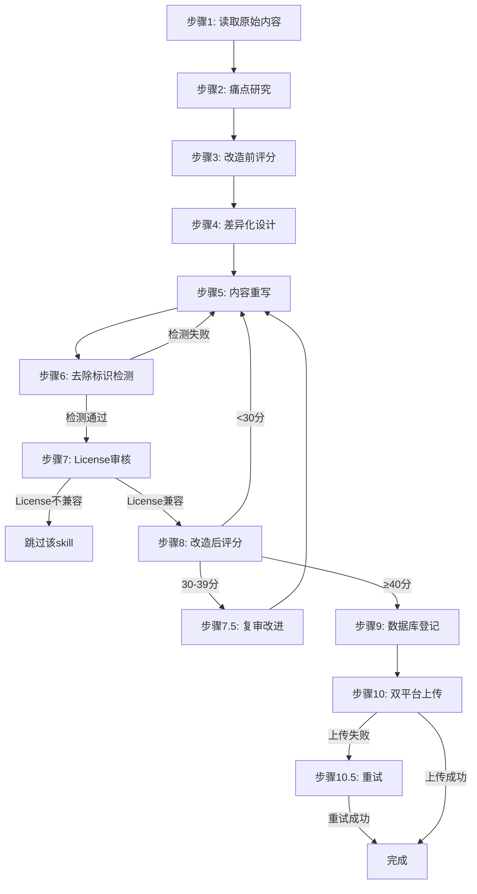

# 详细参考 - skill-production-standards

> 本文件从SKILL.md拆分而来，包含详细代码示例和扩展章节。

## 代码示例 (python)

```python
import sys
sys.path.insert(0, r'd:\skills\skill-registry')
from db import register_skill, record_operation, set_pricing

free_skill_id = register_skill(
    slug='new-slug-free',
    name='new-slug-free',
    display_name='新名称(免费版)',
    version='1.0.0',
    category='Agents',
    source='clawhub_download',
    local_path=r'd:\skills\differentiated-skills\Agents\new-slug-free',
    source_slug='original-slug',
    source_license='MIT',  # v1.1新增：传入license
    skill_type='differentiated',
    pricing_model='free',
    is_differentiated=1
)

pro_skill_id = register_skill(
    slug='new-slug-pro',
    name='new-slug-pro',
    display_name='新名称(专业版)',
    version='1.0.0',
    category='Agents',
    source='clawhub_download',
    local_path=r'd:\skills\differentiated-skills\Agents\new-slug-pro',
    source_slug='original-slug',
    source_license='MIT',
    skill_type='differentiated',
    pricing_model='freemium',
    is_differentiated=1
)

set_pricing(
    skill_id=pro_skill_id,
    edition='pro',
    price_model='monthly',
    price_amount=29.9,
    price_currency='CNY',
    trial_limits='免费版可用核心功能',
    pro_features='批量处理,高级缓存,自定义模板,优先支持'
)

record_operation(
    skill_id=free_skill_id,
    operation_type='differentiate',
    details='完成八大维度差异化改造',
    before_state='original',
    after_state='differentiated'
)
```

## 代码示例 (mermaid)



### 步骤9：数据库登记
```python
import sys
sys.path.insert(0, r'd:\skills\skill-registry')
from db import register_skill, record_operation, set_pricing

free_skill_id = register_skill(
    slug='new-slug-free',
    name='new-slug-free',
    display_name='新名称(免费版)',
    version='1.0.0',
    category='Agents',
    source='clawhub_download',
    local_path=r'd:\skills\differentiated-skills\Agents\new-slug-free',
    source_slug='original-slug',
    source_license='MIT',  # v1.1新增：传入license
    skill_type='differentiated',
    pricing_model='free',
    is_differentiated=1
)

pro_skill_id = register_skill(
    slug='new-slug-pro',
    name='new-slug-pro',
    display_name='新名称(专业版)',
    version='1.0.0',
    category='Agents',
    source='clawhub_download',
    local_path=r'd:\skills\differentiated-skills\Agents\new-slug-pro',
    source_slug='original-slug',
    source_license='MIT',
    skill_type='differentiated',
    pricing_model='freemium',
    is_differentiated=1
)

set_pricing(
    skill_id=pro_skill_id,
    edition='pro',
    price_model='monthly',
    price_amount=29.9,
    price_currency='CNY',
    trial_limits='免费版可用核心功能',
    pro_features='批量处理,高级缓存,自定义模板,优先支持'
)

record_operation(
    skill_id=free_skill_id,
    operation_type='differentiate',
    details='完成八大维度差异化改造',
    before_state='original',
    after_state='differentiated'
)
```


### 6.1 平台规则对比
| 维度 | clawhub | skillhub |
|------|---------|----------|
| slug唯一性 | 全局唯一（owner-qualified） | 全局唯一 |
| API Token | `clh_`开头 | `skh_`开头 |
| 分类支持 | ✅ categories | ❌ 无 |
| 定价机制 | ❌ 无 | ✅ SkillPay |
| 速率限制 | 宽松 | 严格（建议3分钟间隔） |
| 审核机制 | 自动检测重复，Hidden by moderation | slug冲突返回错误 |
| 服务器稳定性 | 稳定 | 偶发566错误 |


### Q6: 如何追踪一个skill的完整历史？
A: 查询数据库：
```sql
SELECT * FROM skills WHERE slug = 'xxx';
SELECT * FROM versions WHERE skill_id = ? ORDER BY created_at;
SELECT * FROM operations WHERE skill_id = ? ORDER BY operation_date;
SELECT * FROM platform_uploads WHERE skill_id = ? ORDER BY upload_date;
SELECT * FROM pricing WHERE skill_id = ?;
```


### 维度5：性能（Performance）- 6分制
| 评分项 | 0分 | 2分 | 4分 | 6分 |
|--------|-----|-----|-----|-----|
| 并行化 | 全串行 | 部分并行 | 依赖图+并行 | 自动并行+负载均衡 |
| 批处理 | 无 | 简单批处理 | 批量+检查点 | 批量+检查点+恢复+幂等 |
| 增量更新 | 无 | 全量更新 | 增量更新 | 增量+版本对比+回滚 |


### 9.3 查询skill完整历史
```python
from db import get_skill_status
status = get_skill_status('ad-insight-hub')
```


### 2.2 免费体验版规范
**目标**：让用户体验核心价值，**不限制使用次数**，仅限制高级功能。

**必须包含**：
- 核心功能（让用户能完成基本任务）
- 快速开始（按复杂度分级：<60s/<120s/<300s）
- 基础FAQ（3-5问）
- 基础示例（1-2个）

**必须限制**（在SKILL.md末尾标注）：
```markdown
本免费体验版限制以下高级功能：
- ❌ [高级功能1]（如：批量处理 > 10条）
- ❌ [高级功能2]（如：高级缓存策略）
- ❌ [高级功能3]（如：自定义模板）

解锁全部功能请使用专业版：[slug]-pro
```

**禁止**：
- ❌ 限制使用次数（如"每天3次"）—— **设计理由**：损害用户体验，降低转化率
- ❌ 限制文件大小（如"<1MB"）—— **设计理由**：技术限制无商业意义
- ❌ 添加水印或广告 —— **设计理由**：降低专业感
- ❌ 强制注册/登录 —— **设计理由**：增加摩擦


---

### 2.3 收费专业版规范
**目标**：提供完整功能+高级特性+优先支持。

**必须包含**（在免费版基础上新增）：
- 全部高级功能（无限制）
- 高级场景指南（3+角色×3+场景）
- 完整FAQ（10+问）+ 故障排查表
- 性能优化策略（缓存/并行/批处理）
- 多平台集成示例
- 版本升级迁移指南

**必须包含**（新增章节）：
```markdown
本专业版相比免费版新增以下能力：
- ✅ [高级功能1]：[价值描述]
- ✅ [高级功能2]：[价值描述]
- ✅ [高级功能3]：[价值描述]

| 版本 | 价格 | 功能 | 适用场景 |
|------|------|------|----------|
| 免费体验版 | ¥0 | 核心功能+基础示例 | 个人试用 |
| 收费专业版 | ¥[XX]/月 | 全功能+高级特性+优先支持 | 团队/企业 |

专业版通过SkillHub SkillPay发布。
```


---

### 示例1：基础用法
```


```


---
