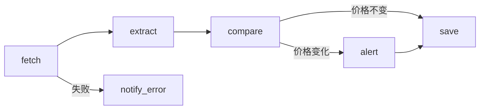

设计并执行跨平台自动化工作流，替代重复性人工操作。核心信条：**先用YAML声明，再干跑验证，最后放量执行；每个工作流必须有幂等键。**

## 四大痛点与对策
| 痛点 | 典型表现 | 本skill对策 |
|:-----|:---------|:------------|
| 复杂分支难调试 | 上线才发现走错分支 | YAML DSL + dry-run干跑校验 |
| 字段映射错位 | 数据串列、空值、类型不符 | 字段映射校验器 + schema版本号 |
| 重复触发 | 同一条记录被处理多次 | 幂等键设计 + 去重检查 |
| API限流 | 批量调用全部被拒 | 令牌桶 + 退避重试 + 批量请求 |

## 第一步：YAML工作流DSL
> 用声明式YAML替代JS片段，可版本化、可diff、可dry-run。

### DSL完整结构
```yaml
workflow:
  name: "竞品价格监控"
  id: "competitor-price-watch"
  version: "1.0"
  description: "每日抓取竞品价格并对比历史，变化即告警"

  idempotency:
    key: "${competitor}_${product_id}_${date}"  # 强制幂等键
    scope: "daily"  # 每日去重
  trigger:
    type: cron  # cron|webhook|watch|manual|event
    config:
      cron: "0 9 * * *"
      tz: "Asia/Shanghai"

  inputs:
    - name: competitor_list
      type: array
      source: "config/competitors.yaml"
      required: true

  steps:
    - id: fetch_price
      name: "抓取价格"
      action: fetch
      config:
        url: "${competitor.url}/product/${product_id}"
        method: GET
        timeout: 30s
      output: raw_html
      on_success: extract
      on_failure: notify_error
      retry:
        max_attempts: 3
        backoff: exponential  # 1s, 2s, 4s
    - id: extract
      name: "提取价格"
      action: transform
      config:
        script: "parse_price(raw_html)"
      output: current_price
      on_success: compare

    - id: compare
      name: "对比历史"
      type: condition
      rules:
        - condition: "current_price != history_price"
          goto: notify_change
        - condition: "default"
          goto: archive

    - id: notify_change
      name: "价格变化告警"
      action: notify
      config:
        channel: slack
        message: "${competitor} ${product} 价格 ${history} → ${current}"
      on_success: archive

    - id: archive
      name: "归档历史"
      action: save
      config:
        path: "data/prices-${date}.json"

  error_handling:
    - id: notify_error
      action: notify
      config:
        channel: slack
        message: "工作流[${workflow.id}]在${failed_step}失败：${error}"
      then: abort

  rate_limit:
    strategy: token_bucket
    capacity: 10  # 桶容量
    refill_per_second: 2  # 每秒补充
    retry_on_429: true
    backoff: exponential

  outputs:
    - name: price_changes
      destination: "data/changes-${date}.json"
      format: json
```

### 触发器类型对照
| 类型 | 配置字段 | 适用场景 |
|:-----|:---------|:---------|
| cron | `cron`, `tz` | 定时任务（每日9点、每周一） |
| webhook | `endpoint`, `secret` | 外部系统回调 |
| watch | `path`, `events` | 文件变化（新增/修改/删除） |
| manual | 无 | 手动触发 |
| event | `source`, `event_name` | 事件总线订阅 |

### 操作节点类型
| action | 用途 | 关键配置 |
|:-------|:-----|:---------|
| fetch | HTTP请求 | url, method, headers, body |
| transform | 数据转换 | script（JS/Python表达式） |
| save | 写文件 | path, format |
| read | 读文件 | file |
| move | 移动文件 | to |
| merge | 合并多输入 | inputs（数组） |
| upload | 上传到云 | destination |
| notify | 发通知 | channel, message |
| decide | 条件判断 | rules（条件数组） |
| wait | 等待 | ms 或 until |

## 第二步：干跑校验（dry-run）
> 上线前必跑。用2-3条样本数据验证全链路，避免上线后才发现走错分支。

### 干跑清单
```yaml
dry_run:
  sample_inputs:
    - { competitor: "A店", product_id: "P001", expected_branch: "notify_change" }
    - { competitor: "B店", product_id: "P002", expected_branch: "archive" }  # 价格未变
    - { competitor: "C店", product_id: "P003", expected_branch: "notify_error" }  # 模拟失败
  checks:
    - 每个分支都被走到至少一次
    - 字段映射无错位（输出字段名与预期一致）
    - 幂等键能去重（同输入跑两次只处理一次）
    - 限流生效（并发不超过capacity）
    - 错误处理触发（模拟429/500/超时）
  no_side_effects:
    - 不真正发通知（写入mock通道）
    - 不真正写文件（写入/tmp/dry-run/）
    - 不真正扣款/下单
```

### 干跑脚本骨架
```python
import yaml
from pathlib import Path

def dry_run(workflow_path, samples):
    wf = yaml.safe_load(Path(workflow_path).read_text(encoding="utf-8"))
    results = []
    for sample in samples:
        ctx = {**sample, "history_price": 100}  # mock历史
        for step in wf["workflow"]["steps"]:
            ctx = execute_step(step, ctx, dry=True)  # dry=True跳过副作用
            if step.get("type") == "condition":
                branch = evaluate_rules(step["rules"], ctx)
                results.append({"sample": sample, "step": step["id"], "branch": branch})
    return results
```

## 第三步：幂等键设计
> 重复触发是工作流第一大坑。每个工作流必须有幂等键。

### 幂等键构造规则
```yaml
idempotency:
  # 规则1：用业务唯一标识 + 时间窗口
  key: "${order_id}"  # 订单处理：一个订单只处理一次
  scope: "global"  # 永不去重
  # 规则2：定时任务用日期
  key: "${competitor}_${date}"  # 每日监控：每日每竞品只跑一次
  scope: "daily"

  # 规则3：webhook用事件ID
  key: "${event.id}"  # webhook：用事件唯一ID
  scope: "global"
```

### 去重检查模式
```python
def process_with_idempotency(item, idempotency_key, redis_client):
    # 处理前先查"是否已处理"
    if redis_client.exists(f"idem:{idempotency_key}"):
        return {"status": "skipped", "reason": "already_processed"}
    # 处理
    result = do_process(item)
    # 处理后标记（带TTL）
    redis_client.setex(f"idem:{idempotency_key}", 86400, "1")  # 24小时TTL
    return result
```

## 第四步：字段映射校验器
> 字段映射错位会导致数据串列。强制双向校验。

### 映射配置
```yaml
field_mapping:
  source_system: "API_A"
  target_system: "Database_B"
  schema_version: "1.2"  # 版本号，源系统升级时检测
  mappings:
    - source: "customer_name"
      target: "contact.full_name"
      transform: none
      required: true  # 缺失则告警
    - source: "email"
      target: "contact.email_address"
      transform: lowercase
      required: true
    - source: "revenue"
      target: "account.annual_revenue"
      transform: "multiply_100"  # 分→元
    - source: "created_at"
      target: "contact.signup_date"
      transform: "iso8601_to_epoch"
  unmapped_source_fields:
    - internal_id  # 故意忽略
  required_target_fields:
    - contact.full_name
    - contact.email_address
```

### 校验器逻辑
```python
def validate_mapping(source_data, mapping_config):
    errors = []
    for m in mapping_config["mappings"]:
        if m.get("required") and m["source"] not in source_data:
            errors.append(f"缺失必填源字段: {m['source']}")
    for field in mapping_config["required_target_fields"]:
        # 检查映射后能否填满目标必填字段
        if not any(m["target"] == field for m in mapping_config["mappings"]):
            errors.append(f"目标必填字段无映射: {field}")
    return errors
```

## 第五步：限流处理模式
### 令牌桶模式
```python
import time
from collections import deque

class TokenBucket:
    def __init__(self, capacity, refill_per_second):
        self.capacity = capacity
        self.tokens = capacity
        self.refill_rate = refill_per_second
        self.last_refill = time.time()

    def acquire(self):
        now = time.time()
        elapsed = now - self.last_refill
        self.tokens = min(self.capacity, self.tokens + elapsed * self.refill_rate)
        self.last_refill = now
        if self.tokens >= 1:
            self.tokens -= 1
            return True
        return False  # 需等待
    def wait_and_acquire(self):
        while not self.acquire():
            time.sleep(0.1)
```

### 退避重试模式
```python
import time, random

def retry_with_backoff(func, max_attempts=3, base_delay=1):
    for attempt in range(max_attempts):
        try:
            return func()
        except RateLimitError:
            delay = base_delay * (2 ** attempt) + random.uniform(0, 1)  # 指数退避+抖动
            time.sleep(delay)
        except ServerError as e:
            if attempt == max_attempts - 1:
                raise
            time.sleep(base_delay * (2 ** attempt))
```

### 批量请求模式
```python
# 错误：逐条调用
for item in items:
    api.create(item)  # 1000条=1000次请求，易触发限流
# 正确：批量调用
for batch in chunked(items, 50):  # 每批50条
    api.batch_create(batch)  # 1000条=20次请求
```

## 第六步：预置工作流模板
### 模板1：竞品价格监控
```yaml
workflow:
  name: "竞品价格监控"
  id: "price-watch"
  trigger:
    type: cron
    config: { cron: "0 9 * * *", tz: "Asia/Shanghai" }
  idempotency:
    key: "${competitor}_${product_id}_${date}"
    scope: daily
  steps:
    - { id: fetch, action: fetch, config: { url: "${url}" }, output: html }
    - { id: extract, action: transform, config: { script: "parse(html)" }, output: price }
    - id: compare
      type: condition
      rules:
        - { condition: "price != history", goto: alert }
        - { condition: "default", goto: save }
    - { id: alert, action: notify, config: { channel: slack, message: "价格变化" } }
    - { id: save, action: save, config: { path: "data/${date}.json" } }
```

### 模板2：内容自动发布
```yaml
workflow:
  name: "内容自动发布"
  id: "content-publish"
  trigger:
    type: watch
    config: { path: "./drafts", events: [create] }
  idempotency:
    key: "${file_name}"
    scope: global
  steps:
    - { id: read, action: read, config: { file: "${trigger.file}" }, output: content }
    - { id: format, action: transform, config: { script: "optimize(content)" }, output: formatted }
    - { id: publish, action: fetch, config: { url: "${platform_api}", method: POST, body: "${formatted}" } }
    - { id: log, action: save, config: { path: "logs/publish-${date}.json" } }
```

### 模板3：数据报告生成
```yaml
workflow:
  name: "周报生成"
  id: "weekly-report"
  trigger:
    type: cron
    config: { cron: "0 8 * * 1", tz: "Asia/Shanghai" }
  idempotency:
    key: "${week_of_year}"
    scope: weekly
  steps:
    - { id: fetch_a, action: fetch, config: { url: "${api_a}" }, output: data_a }
    - { id: fetch_b, action: fetch, config: { url: "${api_b}" }, output: data_b }
    - { id: merge, action: merge, config: { inputs: [data_a, data_b] }, output: merged }
    - { id: calc, action: transform, config: { script: "calc_kpi(merged)" }, output: kpis }
    - { id: render, action: transform, config: { script: "render_pdf(kpis)" }, output: pdf }
    - { id: send, action: notify, config: { channel: email, message: "${pdf}" } }
```

## 第七步：文档自动生成
从YAML自动生成工作流文档：

```yaml
doc_template:
  title: "工作流：${workflow.name}"
  sections:
    - 概述：${workflow.description}
    - 触发条件：${trigger.type} - ${trigger.config}
    - 输入：${inputs}
    - 处理步骤：
        - ${step.id}: ${step.name} → ${step.on_success}
    - 错误处理：${error_handling}
    - 幂等键：${idempotency.key}
    - 限流策略：${rate_limit.strategy}
    - 输出：${outputs}
  visual:
    type: mermaid
    direction: LR
    nodes: ${steps}
    edges: ${step.on_success}, ${step.on_failure}
```

生成Mermaid图示例：



## 使用场景
1. **电商运营** - 价格监控、库存同步、订单处理
2. **内容创作** - 素材收集、格式转换、多平台发布
3. **数据分析** - 数据抓取、清洗、报告生成
4. **客户服务** - 自动回复、工单处理、反馈收集
5. **项目管理** - 进度跟踪、状态同步、提醒通知

## 边界情况与陷阱
- **时区**：cron用Asia/Shanghai，内部时间存UTC
- **并发**：同一工作流不要并发跑同一幂等键
- **大输入**：inputs超过1MB时改用文件引用而非内联
- **超时**：每个step必须设timeout，避免卡死整个工作流
- **重试陷阱**：非幂等操作重试会重复扣款/发邮件，必须先做幂等
- **schema漂移**：源系统加减字段，用schema_version检测并告警

## FAQ
**Q：工作流上线前怎么验证？**
A：跑dry-run，用2-3条样本数据覆盖每个分支，确认字段映射、幂等键、限流、错误处理都生效，且无副作用（通知发到mock、文件写/tmp）。

**Q：同一记录被处理了多次怎么办？**
A：加幂等键。订单用order_id全局去重，定时任务用competitor_date每日去重，webhook用event.id。处理前先查"是否已处理"。

**Q：API限流导致批量失败？**
A：上令牌桶限流（capacity=10, refill=2/s），加指数退避重试（1s/2s/4s+抖动），尽量改批量请求（50条/批）。

**Q：字段映射经常错位？**
A：用字段映射校验器，标required字段，加schema_version号。源系统升级时自动检测并告警。

**Q：复杂分支怎么调试？**
A：YAML声明式DSL可逐分支单测，dry-run时强制覆盖每个分支至少一次。

## 故障排查
| 症状 | 可能原因 | 解决 |
|:-----|:---------|:-----|
| 工作流不触发 | 触发条件太窄 | 检查cron表达式、watch路径、webhook签名 |
| 步骤间歇失败 | API限流或超时 | 加令牌桶、退避重试、延长timeout |
| 数据串列 | 字段映射错位 | 跑字段映射校验器，检查schema_version |
| 重复执行 | 无幂等键 | 加idempotency.key，处理前去重检查 |
| 全部步骤失败 | 凭证过期 | 检查Token，启用轮换告警 |
| 大输入卡死 | 内联数据过大 | 改用文件引用，inputs走文件路径 |
| 分支走错 | 条件表达式写错 | dry-run单测该分支，打印中间变量 |

## 依赖说明
### 运行环境
- **Agent平台**：支持SKILL.md的任意AI Agent（Claude Code / Cursor / Codex / Gemini CLI等）
- **操作系统**：Windows / macOS / Linux

### 依赖说明
| 依赖项 | 类型 | 是否必需 | 获取方式 |
|:-------|:-----|:---------|:---------|
| LLM API | API | 必需 | 由Agent内置LLM提供 |
| Redis | 服务 | 可选（幂等去重） | 自部署或云服务 |
| 外部系统API | API | 按需 | 各服务商提供 |

### API Key 配置
- 本skill基于Markdown指令，无需额外API Key
- 涉及外部系统集成时，通过环境变量配置各API Key/OAuth Token

### 可用性分类
- **分类**：MD+EXEC（Markdown指令 + YAML/脚本执行）
- **说明**：通过自然语言指令驱动Agent按YAML DSL构建并执行工作流

## 核心能力
- 流程架构师是跨平台自动化工作流的设计与执行能力包
- 它不只给JS示例，更解决四个高频
  痛点：复杂分支逻辑难以调试、字段映射错位导致数据串列、重复触发造成重复处理、
  API限流未处理导致批量失败

## 使用流程
1. 确认运行环境满足依赖说明中的要求
2. 根据适用场景选择合适的使用方式
3. 执行操作并检查输出结果
4. 如遇错误，参考错误处理章节

## 示例
### 示例1：基础用法
```
输入: 用户请求
处理: 根据使用流程执行
输出: 处理结果
```

## 已知限制
- 需要API Key，无Key环境无法使用
