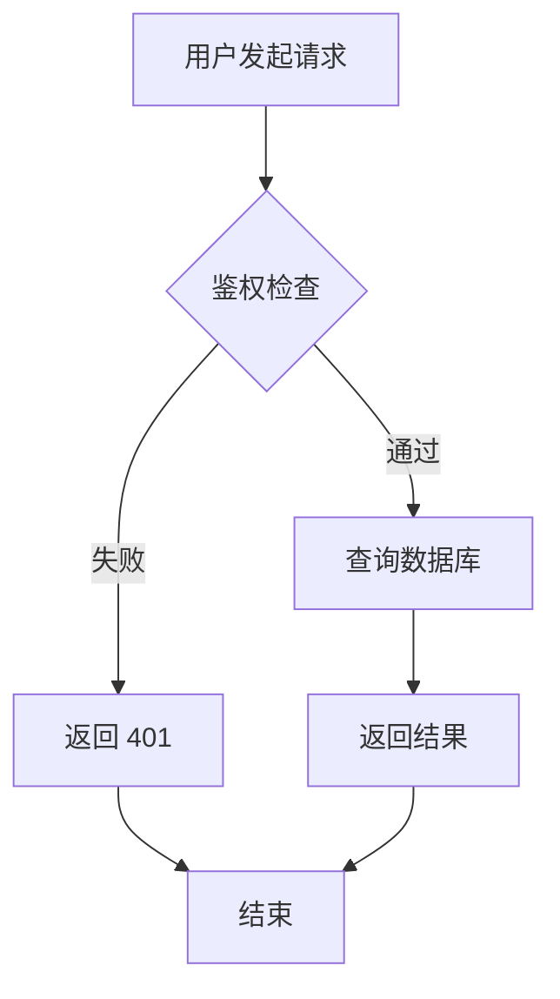
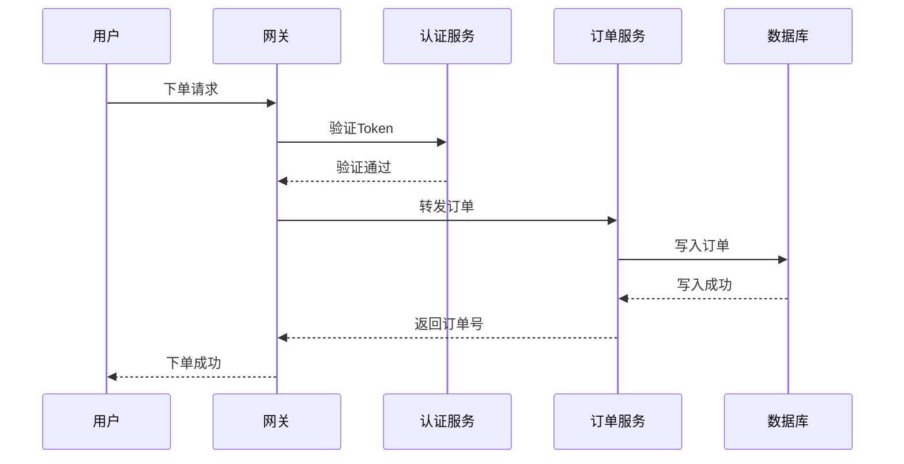
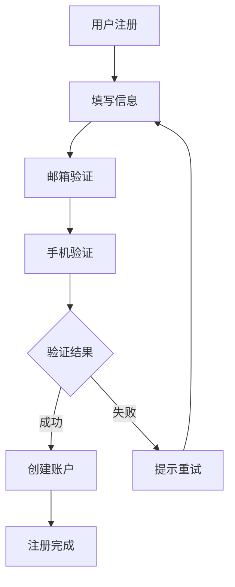
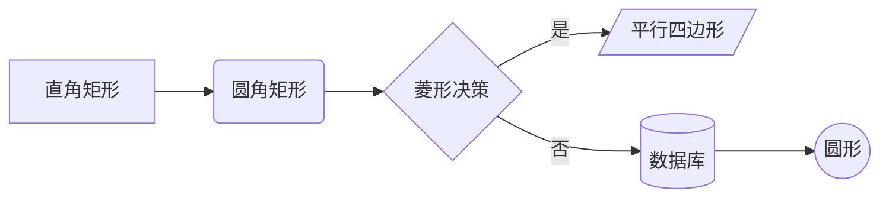
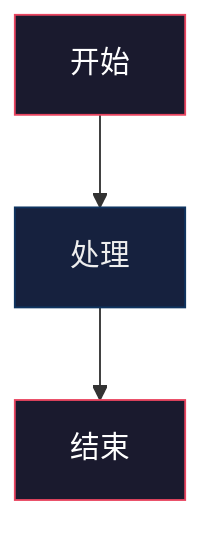

# 图表生成工具（免费版）

## 概述

图表生成工具免费版是一款轻量级的图表制作方案，聚焦 Mermaid 格式的流程图与序列图生成。通过自然语言描述即可生成结构化的图表代码，直接嵌入 Markdown 文档使用，无需安装额外软件。

本版本特别适合技术文档编写、代码仓库文档补充和个人项目架构草图制作。所有输出均为标准 Mermaid 语法，与 GitHub、GitLab 等平台原生兼容。

## 核心能力

| 能力 | 说明 |
|:-----|:-----|
| 自然语言转图表 | 用中文或英文描述需求，自动生成图表代码 |
| 流程图生成 | 支持决策分支、循环、并行流程 |
| 序列图生成 | 支持参与者、消息、激活期、注释 |
| Markdown 内嵌 | 输出可直接粘贴到 Markdown 文档 |
| 文件编辑 | 可读取并修改已有的 `.mmd` 文件 |

### 免费版支持的图表类型

```text
流程图 (Flowchart):
  - 线性流程
  - 决策分支 (if/else)
  - 循环结构
  - 并行流程

序列图 (Sequence):
  - 参与者定义
  - 同步/异步消息
  - 激活期
  - 注释与分组
```

## 使用场景

### 场景一：技术文档流程图

为 API 文档添加请求处理流程图。

**输入描述：**
> 用户发起请求 → 鉴权检查 → 通过则查询数据库 → 返回结果；失败则返回 401

**生成结果：**



**使用方式：**

```bash
# 保存为 .mmd 文件
cat > request-flow.mmd << 'EOF'
flowchart TD
    A[用户发起请求] --> B{鉴权检查}
    B -->|通过| C[查询数据库]
    B -->|失败| D[返回 401]
    C --> E[返回结果]
    D --> F[结束]
    E --> F
EOF

# 或直接嵌入 Markdown 文档
echo "将上述 mermaid 代码块粘贴到 .md 文件中即可"
```

### 场景二：微服务交互序列图

绘制服务间的调用序列。



### 场景三：编辑已有图表

读取并修改现有的 Mermaid 文件。

```bash
# 读取已有图表
cat architecture.mmd

# 修改后保存（新增一个节点）
cat > architecture-updated.mmd << 'EOF'
flowchart LR
    A[前端] --> B[API网关]
    B --> C[用户服务]
    B --> D[商品服务]
    B --> E[订单服务]
    E --> F[(消息队列)]
    F --> G[通知服务]
EOF
```

## 快速开始

### 第一步：描述你的图表需求

用自然语言告诉工具你想要什么图表：

```text
请生成一个流程图：
- 起点：用户注册
- 步骤：填写信息 → 邮箱验证 → 手机验证
- 分支：验证成功 → 创建账户；验证失败 → 提示重试
- 终点：注册完成
```

### 第二步：获取生成的代码

工具会输出标准 Mermaid 代码：



### 第三步：使用图表

```bash
# 方式1：保存为独立文件
echo 'flowchart TD\n    A[开始] --> B[结束]' > diagram.mmd

# 方式2：嵌入 Markdown
# 将 mermaid 代码包裹在 ```mermaid ``` 代码块中

# 方式3：导出为图片（需要 mermaid-cli）
npx @mermaid-js/mermaid-cli -i diagram.mmd -o diagram.png
```

## 配置示例

### 流程图方向配置

```text
flowchart 方向说明:
  TD / TB  →  从上到下（默认）
  LR       →  从左到右
  RL       →  从右到左
  BT       →  从下到上
```

### 节点样式快速参考



### 常用样式自定义



## 最佳实践

1. **保持简洁**：单张图表节点不超过 15 个，复杂流程拆分为多张子图。
2. **方向选择**：线性流程用 TD，并行流程用 LR，提升可读性。
3. **命名规范**：节点 ID 用字母缩写，显示名用中文描述。
4. **分支标注**：决策分支务必标注"是/否"或具体条件。
5. **文档集成**：Mermaid 代码直接嵌入 Markdown，无需额外图片文件。

```text
免费版最佳实践检查:
[ ] 单图节点数 ≤ 15
[ ] 决策分支已标注条件
[ ] 方向选择符合阅读习惯
[ ] 节点命名清晰（ID + 显示名）
[ ] 已嵌入 Markdown 文档测试渲染
```

## 常见问题

### Q: 免费版支持 Draw.io 或 Excalidraw 吗？

A: 免费版仅支持 Mermaid 格式。Draw.io（`.drawio`）和 Excalidraw（`.excalidraw`）需要升级至专业版。

### Q: 生成的图表如何导出为图片？

A: 使用 `mermaid-cli` 工具：`npx @mermaid-js/mermaid-cli -i input.mmd -o output.png`。GitHub 和多数 Markdown 编辑器原生支持 Mermaid 渲染。

### Q: 可以生成网络拓扑图或架构图吗？

A: 免费版支持基础的架构流程图，但复杂的网络拓扑图（含机房、区域层级）需要专业版。

### Q: Mermaid 语法在哪里可以查阅？

A: 访问 mermaid 官方文档 mermaid.js.org 获取完整语法参考。

### Q: 图表节点过多导致渲染拥挤怎么办？

A: 建议拆分为多张子图，或使用 `subgraph` 分组。单图节点超过 15 个时考虑重构。

## 依赖说明

### 运行环境
- **Agent平台**: 支持SKILL.md的任意AI Agent（Claude Code / Cursor / Codex / Gemini CLI等）
- **操作系统**: Windows / macOS / Linux
- **浏览器/编辑器**: 任何支持 Mermaid 渲染的环境

### 第三方依赖
| 依赖项 | 类型 | 是否必需 | 获取方式 |
|:-------|:-----|:---------|:---------|
| LLM API | API | 必需 | 由Agent内置LLM提供 |
| Mermaid.js | 渲染库 | 可选 | CDN自动加载或编辑器内置 |
| mermaid-cli | 工具 | 可选 | `npm install -g @mermaid-js/mermaid-cli` |

### API Key 配置
- 本Skill采用纯Markdown指令驱动，无需额外API Key
- 图片导出功能（可选）需本地安装 mermaid-cli

### 可用性分类
- **分类**: MD+EXEC（纯Markdown指令，部分功能需要exec命令行执行能力）
- **说明**: 轻量级AI Skill，通过自然语言指令生成Mermaid格式图表
- **适用规模**: 个人开发者，技术文档编写
