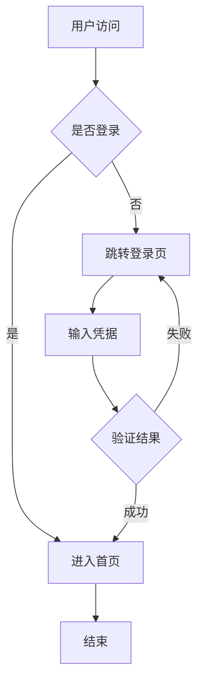
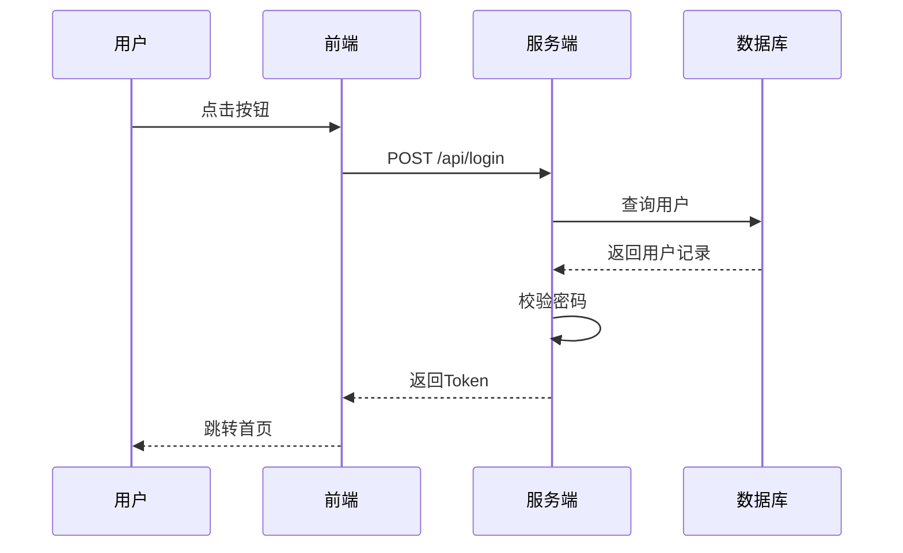
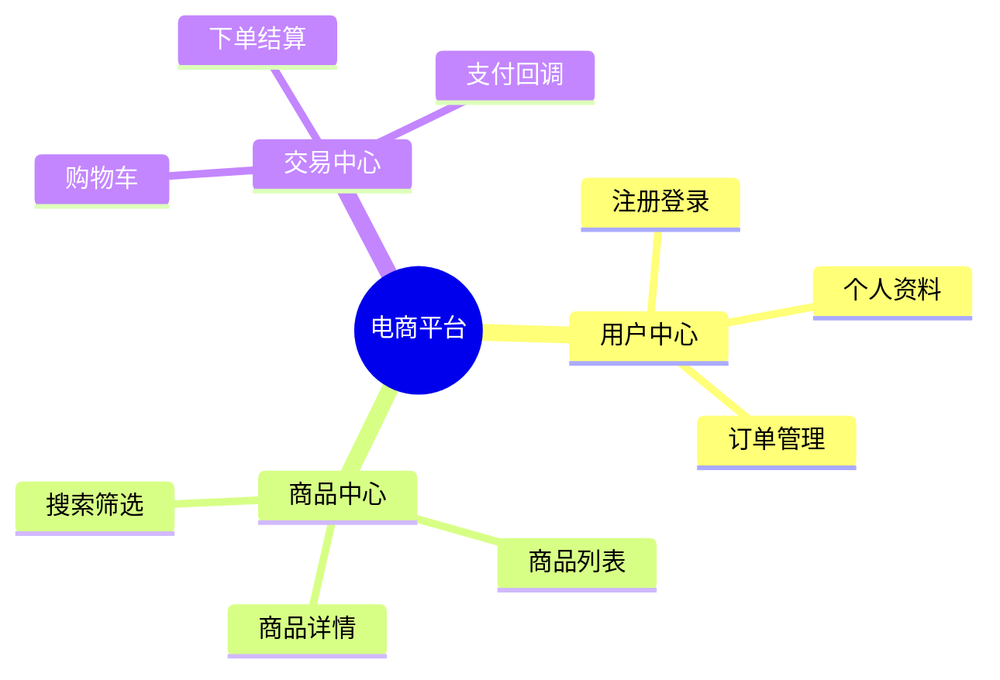

# Mermaid图表工具(免费版)

## 概述

Mermaid图表工具(免费版)为个人用户从文本描述生成符合语法的 Mermaid 图表代码。当你在请求中提及 流程图、时序图、脑图 或需要可视化业务流程时,本工具会自动激活,根据需求推荐合适的图表类型并输出可直接粘贴到 Markdown 的代码块.
本版本聚焦7种基础图表类型与个人使用场景,适合技术文档配图、简单流程可视化与 Mermaid 语法学习。如需复杂多节点图、自定义主题、批量生成与CI集成,请升级至 PRO 版本.
## 核心能力

| 能力 | 说明 |
|---|---|
| 图表类型选择 | 根据需求推荐合适的Mermaid图表类型 |
| 代码生成 | 输出符合语法的Mermaid代码,包裹在 ```mermaid 块 |
| 中文标签适配 | 用户用中文描述时,生成中文标签 |
| 基础语法校验 | 输出前自检常见语法错误 |
| 注释支持 | 复杂图表自动添加 `%%` 注释分段 |
**技术实现要点**：核心能力基于`input_params`参数与`output_format`配置实现,支持创建/查询/修改/删除等操作模式,通过`config_options`进行运行时配置.
### 核心功能执行
用`input_params`参数进行配置.
**输入**: 用户提供核心功能执行所需的指令和必要参数.
**处理**: 解析核心功能执行的输入参数,完成核心逻辑,返回结构化响应.
**输出**: 返回核心功能执行的响应数据,包含状态码、结果和日志.
- 执行此能力时使用`input_params`参数,支持创建/查询/导出操作

### 参数配置与调用
用`config_options`参数进行配置.
**输入**: 用户提供参数配置与调用所需的指令和必要参数.
**处理**: 解析参数配置与调用的输入参数,完成核心逻辑,返回结构化响应.
**输出**: 返回参数配置与调用的响应数据,包含状态码、结果和日志.
- 执行此能力时使用`config_options`参数,支持修改/重置/导入操作

### 结果处理与输出
用`output_format`参数进行配置.
**输入**: 用户提供结果处理与输出所需的指令和必要参数.
**处理**: 解析结果处理与输出的输入参数,完成核心逻辑,返回结构化响应.
**输出**: 返回结果处理与输出的响应数据,包含状态码、结果和日志.
- 执行此能力时使用`output_format`参数,支持导出/保存/转换操作
**能力覆盖范围**：本skill的核心能力覆盖以下场景关键词：个人用户从文本生、流程图、时序图、脑图等基础图表代、图表工具、免费版、为个人用户从文本、描述生成符合语法、图表代码、支持流程图、状态图等基础类型、种基础图表类型选、择与生成、中文标签自动适配、基础语法校验与常、见错误规避、标准代码块输出、可直接粘贴到、Markdown等。这些关键词对应description中声明的使用场景,均已在上述能力点中提供对应的操作支持.
## 使用场景

### 场景一:为技术文档绘制业务流程

用户描述一个登录流程,工具生成流程图.


### 场景二:绘制API交互时序图

用户描述前后端API交互,工具生成时序图.


### 场景三:产品功能脑图

用户描述产品功能结构,工具生成脑图.


## 快速开始

1. 阅读## 核心能力章节了解skill功能
2. 按## 依赖说明配置环境
3. 执行所需能力对应的命令
4. 参考## 错误处理章节处理异常
5. 查看## FAQ解答常见疑问

### 1. 直接描述需求

在请求中描述你想可视化的内容,工具自动选择图表类型:

```text
用户: 帮我画一个用户注册流程图
工具: 推荐使用 flowchart TD,生成如下代码...
```

### 2. 指定图表类型

如果你明确知道要哪种图:

```text
用户: 用时序图画出 OAuth2 授权码流程
工具: 生成 sequenceDiagram 代码...
```

### 3. 基础语法速览

```text
flowchart TD
    A[开始] --> B{判断条件}
    B -- 是 --> C[执行操作]
    B -- 否 --> D[结束]
    C --> D
```

```text
sequenceDiagram
    用户->>服务端: 发起请求
    服务端->>数据库: 查询数据
    数据库-->>服务端: 返回结果
    服务端-->>用户: 响应
```

```text
mindmap
  root((产品名))
    功能A
      子功能1
      子功能2
    功能B
```

## 示例

### 图表类型选择参考

| 需求 | 推荐类型 | Mermaid 关键字 |
|:-----|:-----|:-----|
| 业务流程 / 逻辑流程 | Flowchart | `flowchart TD` |
| 系统交互 / API 时序 | Sequence | `sequenceDiagram` |
| 产品架构 / 系统结构 | Flowchart / C4 | `flowchart LR` |
| 状态机 / 用户状态 | State | `stateDiagram-v2` |
| 脑图 / 功能树 | Mindmap | `mindmap` |
| 数据库结构 | ER | `erDiagram` |
| 项目时间线 | Timeline | `timeline` |
| 用户旅程 | Journey | `journey` |

### 常见节点形状

```text
flowchart TD
    A[矩形节点]
    A --> B(圆角节点)
    A --> C{菱形判断}
    A --> D[/平行四边形/]
    A --> E[(数据库)]
    A --> F((圆形))
```

## 最佳实践

### 1. 输出规则

- 始终用 ```` ```mermaid ```` 代码块包裹输出
- 用户用中文描述时,生成中文标签
- 复杂图表添加 `%%` 注释分段说明
- 节点名保持简短(≤10字符)避免布局问题
- 输出前自检语法,常见错误:
  - 含空格/中文的标签未加引号
  - 箭头语法错误(`-->` vs `---` vs `->>`)
  - 括号未闭合

### 2. 流程图方向选择

| 方向 | 关键字 | 适用场景 |
|---:|---:|---:|
| 从上到下 | `TD` / `TB` | 线性流程 |
| 从左到右 | `LR` | 架构图、层级图 |
| 从下到上 | `BT` | 倒推流程 |
| 从右到左 | `RL` | 较少使用 |

### 3. 时序图参与者类型

```text
sequenceDiagram
    actor U as 用户
    participant F as 前端
    participant B as 后端
    participant D as 数据库
    U->>F: 操作
```

### 4. 状态图基础

```text
stateDiagram-v2
    [*] --> 待审核
    待审核 --> 已通过: 审核通过
    待审核 --> 已拒绝: 审核拒绝
    已通过 --> [*]
    已拒绝 --> [*]
```

### 5. ER图基础

```text
erDiagram
    USER ||--o{ ORDER : 下单
    USER {
        int id PK
        string name
    }
    ORDER {
        int id PK
        int user_id FK
        decimal amount
    }
```

## 常见问题

### Q1:免费版支持哪些图表类型?

支持流程图、时序图、状态图、脑图、ER图、时间线、用户旅程7种基础类型。如需C4架构图、Git图、类图、批量生成等,请使用PRO版.
### Q2:生成的图表能直接渲染吗?

可以。生成的代码包裹在 ```mermaid 块中,支持Mermaid渲染的平台(GitHub、GitLab、Notion、VS Code插件等)可直接显示.
### Q3:节点名太长导致布局混乱怎么办?

建议节点名保持简短(≤10字符),长文本放到标签中并用引号包裹。例如 `A["这是一个较长的标签说明"]`.
### Q4:免费版与PRO版差异?

| 维度 | 免费版 | PRO版 |
|:---:|:---:|:---:|
| 图表类型 | 7种基础 | 全类型(含C4、Git图、类图) |
| 节点规模 | 简单图 | 复杂多节点图 |
| 主题样式 | 默认 | 自定义主题与样式 |
| 批量生成 | 不支持 | 从文档批量生成 |
| 校验集成 | 基础自检 | CI语法校验 |
| 文档集成 | 不支持 | 自动嵌入Markdown |
| 支持 | 社区支持 | 优先支持 |

### Q5:如何处理中文标签的引号问题?

含空格或中文的标签建议用引号包裹,避免渲染异常。例如 `A["用户登录"]` 而非 `A[用户登录]`.
## 依赖说明

### 运行环境

- **Agent平台**: 支持SKILL.md的任意AI Agent(Claude Code / Cursor / Codex / Gemini CLI等)
- **操作系统**: Windows / macOS / Linux
- **Mermaid版本**: 建议 10.x 及以上(用于渲染预览)

### 依赖详情

| 依赖项 | 类型 | 是否必需 | 获取方式 |
|:------|------:|:------|:------|
| LLM API | API | 必需 | 由Agent内置LLM提供 |
| Mermaid CLI | 命令行工具 | 可选 | `npm i -g @mermaid-js/mermaid-cli`(本地渲染) |
| VS Code插件 | 编辑器插件 | 可选 | 安装 "Markdown Preview Mermaid Support" |

### API Key 配置

- 本skill基于Markdown指令规范,无需额外API Key.
- 本地渲染预览通过 Mermaid CLI 完成,不依赖外部API.
### 可用性分类

- **分类**: MD+EXEC(纯Markdown指令,部分功能需exec命令行执行)
- **说明**: 基于Markdown的AI Skill,通过自然语言指令驱动Agent完成操作。免费版聚焦个人用户的7种基础Mermaid图表生成.
## 错误处理

| 错误场景 | 原因 | 处理方式 |
|---:|:---|---:|
| 配置错误 | 参数缺失或格式错误 | 检查依赖说明中的配置要求 |
| 运行时错误 | 运行环境不满足 | 确认运行环境符合依赖说明 |
| 网络错误 | 连接超时或不可达 | 执行ping命令测试网络连通性,检查防火墙和代理设置连接后执行ping命令测试网络连通性,检查防火墙和代理设置连接后重新执行命令，参考国内替代方案 |

## 已知限制

- 需LLM支持,无LLM环境不可用
- 复杂业务场景建议结合人工经验判断
- 执行效率受模型能力与网络环境影响
