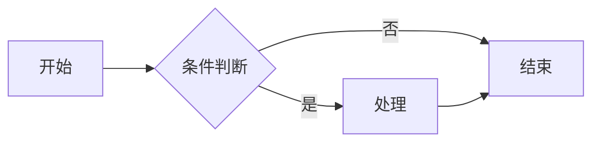
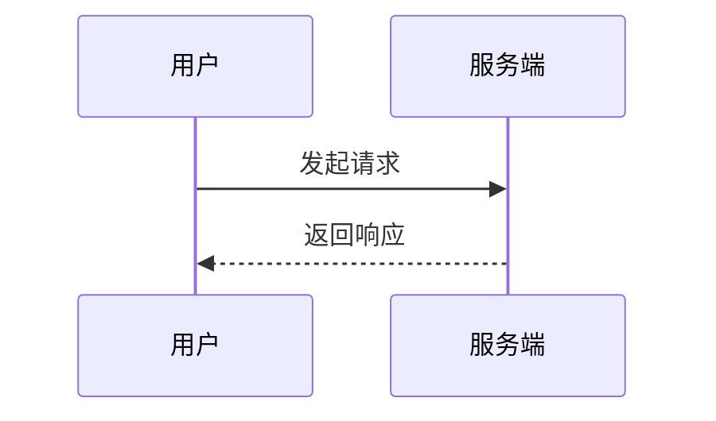
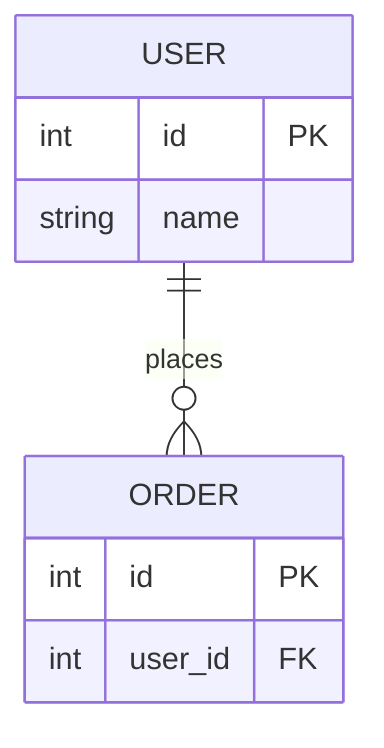
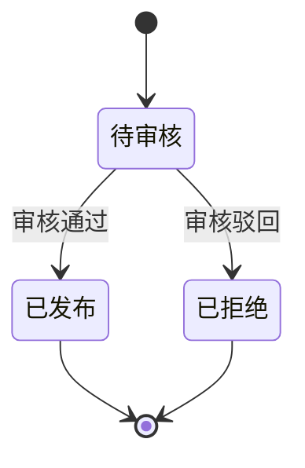

# 图表工具免费版（Diagram Tool Free）

## 概述

图表的本质是"澄清"而非"复杂化"。本Skill帮助用户用最少的节点表达最清晰的结构关系，从一句话描述到一份可嵌入文档的Mermaid图表，全过程不超过60秒。

设计原则：
1. **简单优先**：5个节点的清晰流程图胜过50个节点的混乱网状图
2. **类型匹配**：根据问题域自动选择最合适的图表类型
3. **可迭代**：先产出最小可用版本，再根据反馈逐步丰富细节
4. **可移植**：默认输出Mermaid代码块，兼容GitHub、Notion、Obsidian等主流平台

## 核心能力

### 支持的图表类型

| 类型 | 适用场景 | 输出格式 |
|------|----------|----------|
| 流程图（Flowchart） | 业务流程、决策树、工作流 | Mermaid `flowchart` |
| 时序图（Sequence） | API调用、交互协议、消息流 | Mermaid `sequenceDiagram` |
| 架构图（Architecture） | 系统组件、基础设施拓扑 | Mermaid `flowchart` + subgraph |
| ER图（ER Diagram） | 数据库表结构、实体关系 | Mermaid `erDiagram` |
| 类图（Class） | 对象结构、继承关系 | Mermaid `classDiagram` |
| 状态图（State） | 生命周期、状态机 | Mermaid `stateDiagram-v2` |

**输入**: 用户提供支持的图表类型所需的指令和必要参数。
**处理**: 按照skill规范执行支持的图表类型操作,遵循单一意图原则。
**输出**: 返回支持的图表类型的执行结果,包含操作状态和输出数据。

### 输出方式

| 方式 | 适用场景 | 是否需要命令行 |
|------|----------|----------------|
| Mermaid代码块 | 文档嵌入（GitHub、Notion、Obsidian） | 否 |
| PNG导出 | 需要图片文件的场景 | 是（npx命令） |
| ASCII内联 | 聊天中快速草图 | 否 |

**输入**: 用户提供输出方式所需的指令和必要参数。
**处理**: 按照skill规范执行输出方式操作,遵循单一意图原则。
**输出**: 返回输出方式的执行结果,包含操作状态和输出数据。

### 核心功能执行
用`input_params`参数进行配置。

**输入**: 用户提供核心功能执行所需的指令和必要参数。
**处理**: 按照skill规范执行核心功能执行操作,遵循单一意图原则。
**输出**: 返回核心功能执行的执行结果,包含操作状态和输出数据。
- 执行此能力时使用`input_params`参数,支持创建/查询/导出操作
**能力覆盖范围**：本skill的核心能力覆盖以下场景关键词：通过自然语言生成、快速可视化系统结、构与业务流程、图表工具免费版是、一款面向开发者与、技术写作者的智能、图表生成、支持通过自然语言、描述快速产出标准、核心能力、识别用户意图并自、动选择流程图、状态图等合适类型、内置风格规范与节、点数量约束、避免过度复杂的、蜘蛛网、式图表、Markdown、内联渲染与基础、兼容主流文档平台、提供迭代式细化能等。这些关键词对应description中声明的使用场景,均已在上述能力点中提供对应的操作支持。

## 使用场景

### 场景一：技术文档配图
撰写API文档时，需要一张时序图说明客户端与服务端的交互流程。直接描述"用户登录流程：客户端发送凭证到认证服务，认证服务查询用户库，返回Token"，即可得到标准时序图。

### 场景二：架构评审
评审微服务架构时，用架构图展示服务间依赖关系。subgraph分组让领域边界一目了然，评审者能快速发现循环依赖与单点故障。

### 场景三：数据库设计
设计新业务表时，用ER图表达实体关系，避免漏掉外键和索引。一对多、多对多关系通过Mermaid语法直观呈现。

### 场景四：需求澄清
产品经理描述需求时，用流程图把分支逻辑可视化，开发与测试能快速发现遗漏的边界情况，减少返工。

### 场景五：教学讲解
讲解算法或系统设计时，用状态图展示生命周期，用流程图展示执行路径，比纯文字描述效率提升数倍。

## 不适用场景

以下场景图表工具免费版不适合处理：

- 实时流数据处理
- 小规模数据手动分析
- 非结构化文本情感分析

## 触发条件

需要数据分析、报表生成、统计洞察、数据可视化时使用。不适用于非本工具能力范围的需求。

## 快速开始

### 60秒上手

1. **描述需求**：用自然语言告诉Agent你想画什么
2. **确认类型**：Agent会根据描述推荐合适的图表类型
3. **得到代码**：直接复制Mermaid代码块到文档中
4. **按需迭代**：告诉Agent"加一个缓存层"或"简化为3个节点"

### 示例

```
用户：帮我画一个用户注册流程，包含邮箱验证
Agent：[识别为流程图，生成Mermaid代码]

用户：把验证服务单独拆出来作为一个节点
Agent：[调整图表结构，重新输出]
```

### 渲染为PNG

当需要图片文件时，使用Mermaid CLI本地渲染：

```bash
npx -y @mermaid-js/mermaid-cli mmdc -i diagram.mmd -o diagram.png -b transparent
```

## 配置示例

### 风格规范

- 流程图默认从左到右（LR），层级结构从上到下（TB）
- 单张图表节点数量不超过15个，超出则拆分为多张
- 系统名用大写，动作用小写，保持命名一致
- 使用subgraph分组相关组件
- 慎用颜色，仅高亮关键路径

### Mermaid速查

**流程图骨架**：


**时序图骨架**：


**ER图骨架**：


**状态图骨架**：


## 最佳实践

1. **先简后繁**：第一版只画核心节点，确认无误后再补充异常分支
2. **统一抽象层级**：不要在同一张图里混杂数据库表与业务概念
3. **箭头方向一致**：避免双向箭头造成阅读混乱
4. **标签简短**：节点名不超过5个字，过长则用图例说明
5. **拆分大图**：超过15个节点时拆分为多张子图，每张聚焦一个子域
6. **关键路径高亮**：用颜色或加粗标识最重要的执行路径，其余保持中性
7. **命名一致**：同一实体在不同图中使用相同名称，便于跨图关联

## 常见问题

### Q1：生成的图表在文档里不渲染？
A：检查Mermaid版本是否支持所用语法。GitHub、GitLab、Notion、Obsidian默认支持Mermaid，部分平台需要在设置中开启Mermaid渲染选项。

### Q2：节点太多看不清怎么办？
A：本Skill强制节点上限为15个。超出时Agent会主动建议拆分为多张图，并给出拆分方案与子图之间的关联说明。

### Q3：能生成PlantUML或SVG吗？
A：免费版仅支持Mermaid与ASCII。PlantUML语法、SVG矢量导出、自定义模板属于专业版能力，详见diagram-tool-pro。

### Q4：图表颜色能自定义吗？
A：免费版遵循内置风格规范，仅高亮关键路径。深度样式定制、主题切换、品牌色适配属于专业版能力。

### Q5：能否批量生成多张图？
A：免费版单次会话生成1张图。批量图表生成、版本管理与对比属于专业版能力。

### Q6：生成的图表能导出为其他格式吗？
A：免费版支持Mermaid代码块与PNG导出。SVG、PDF、HTML交互式页面属于专业版能力。

## 已知限制

本免费体验版限制以下高级功能：
- ❌ PlantUML语法支持（复杂UML场景）
- ❌ SVG矢量图导出
- ❌ 自定义模板与主题
- ❌ 批量图表生成（>1张/次）
- ❌ 图表版本管理与对比
- ❌ HTML交互式页面输出

解锁全部功能请使用专业版：diagram-tool-pro
- 当前为免费版本,如需完整功能请升级到付费版获取全部能力
## 依赖说明

### 运行环境
- **Agent平台**：支持SKILL.md的任意AI Agent（Claude Code / Cursor / Codex / Gemini CLI等）
- **操作系统**：Windows / macOS / Linux
- **Node.js**：16+（仅PNG导出时需要）

### 依赖详情
| 依赖项 | 类型 | 是否必需 | 获取方式 |
|:-------|:-----|:---------|:---------|
| LLM API | API | 必需 | 由Agent平台内置LLM提供 |
| Mermaid CLI | npm包 | 可选 | `npm i -g @mermaid-js/mermaid-cli` |
| Markdown渲染器 | 平台能力 | 必需 | GitHub/Notion/Obsidian内置 |

### API Key 配置
- 本skill基于Markdown指令规范，无需额外API Key
- PNG导出使用本地npx命令，不涉及外部API调用

### 可用性分类
- **分类**：MD+EXEC（纯Markdown指令，PNG导出需要exec命令行执行能力）
- **说明**：基于Markdown的AI Skill，通过自然语言指令驱动Agent完成操作

## 错误处理


| 错误场景 | 原因 | 处理方式 |
|---------|------|---------|
| 配置错误 | 参数缺失或格式错误 | 检查依赖说明中的配置要求 |
| 运行时错误 | 运行环境不满足 | 确认运行环境符合依赖说明 |
| 网络错误 | 连接超时或不可达 | 执行ping命令测试网络连通性,检查防火墙和代理设置连接后执行ping命令测试网络连通性,检查防火墙和代理设置连接后重新执行命令，参考国内替代方案 |
