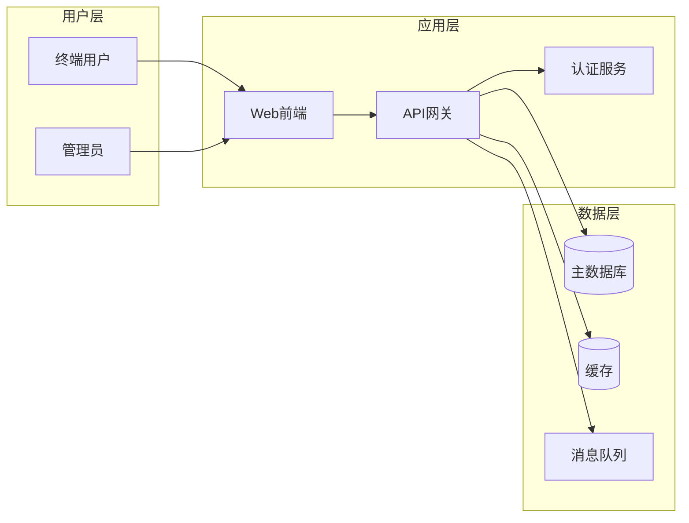
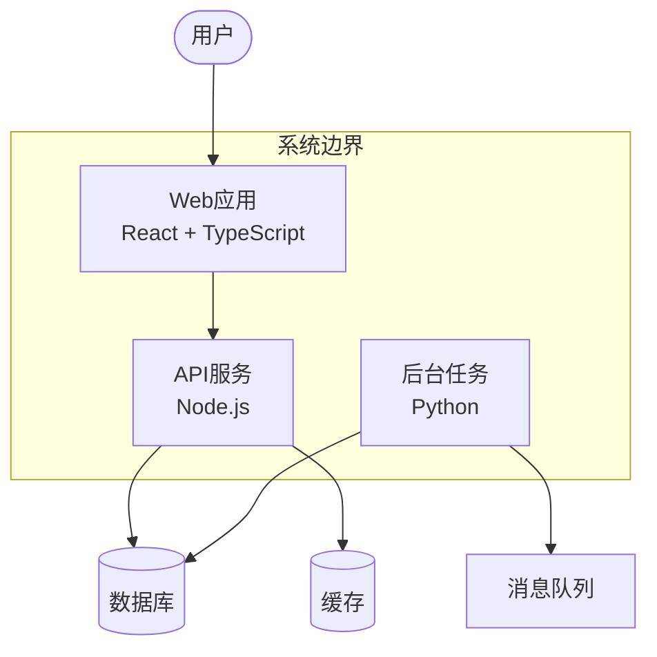
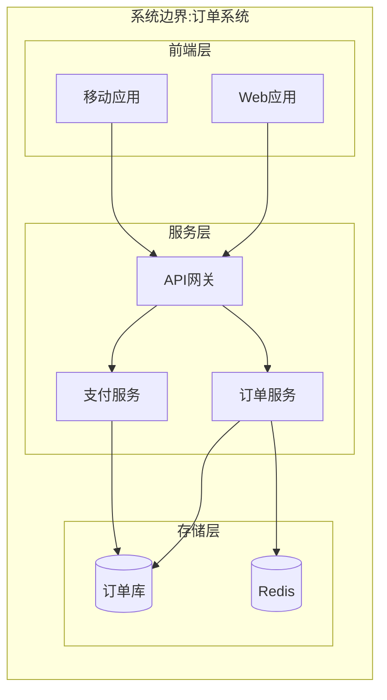
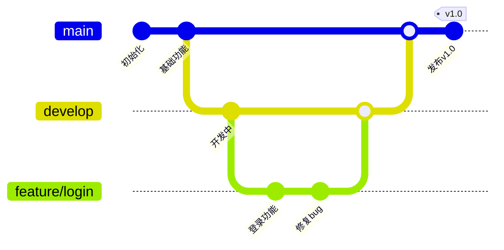

# Mermaid图表工具(专业版)

## 付费版专享能力

| 能力 | 免费版 | 付费版 |
|:-----|:-------|:-------|
| 能力模块 | 支持 | 支持 |
| 与免费版差异 | 不支持 | 支持 |
| 基础类型 | 不支持 | 支持 |
| 与免费版一致 | 不支持 | 支持 |
| 批量处理 | 不支持 | 支持 |
| 高级配置 | 不支持 | 支持 |

## 核心能力

| 能力模块 | 说明 | 与免费版差异 |
| --- | --- | --- |
| 基础类型 | 流程图、时序图、状态图、脑图、ER图、时间线、用户旅程 | 与免费版一致 |
| 进阶类型 | C4架构图、Git图、类图、需求图、Sankey图 | 免费版无 |
| 复杂图 | 多节点子图分组、跨图引用、注释分段 | 免费版仅简单图 |
| 主题样式 | 自定义主题、品牌色、CSS样式注入 | 免费版默认样式 |
| 批量生成 | 从Markdown/PRD文档批量提取并生成多图 | 免费版仅单图 |
| CI校验 | 流水线语法校验,阻断错误图表 | 免费版仅基础自检 |
| 文档嵌入 | 自动嵌入Markdown并保持版本同步 | 免费版无 |
| 图表模板 | 团队图表模板库 | 免费版无 |
### 能力模块

执行能力模块,自动处理参数解析、任务调度和结果格式化,返回结构化输出。

**输入**: 用户提供能力模块相关的配置参数、输入数据和处理选项。

**输出**: 返回能力模块的处理结果。- 验证执行结果，确认输出符合预期格式
- 参考`能力模块`相关配置参数进行设置
### 基础类型

执行基础类型,自动处理参数解析、任务调度和结果格式化,返回结构化输出。

**输入**: 用户提供基础类型相关的配置参数、输入数据和处理选项。

**输出**: 返回基础类型的处理结果。- 验证执行结果，确认输出符合预期格式
- 参考`基础类型`相关配置参数进行设置
### 进阶类型

执行进阶类型,自动处理参数解析、任务调度和结果格式化,返回结构化输出。

**输入**: 用户提供进阶类型相关的配置参数、输入数据和处理选项。

**输出**: 返回进阶类型的处理结果。- 验证执行结果，确认输出符合预期格式
- 参考`进阶类型`相关配置参数进行设置
#
## 适用场景

### 场景一:企业C4架构图

团队需要绘制C4模型的系统架构,工具生成结构化架构图。



C4容器图示例:



### 场景二:批量从PRD生成图表

团队有大量PRD文档,希望批量提取流程并生成图表。

```bash
# 从PRD文档批量生成图表
node （请参考skill目录中的脚本文件） \
  --input docs/prd/ \
  --output docs/diagrams/ \
  --format mermaid \
  --embed

# 输出
# docs/diagrams/prd-001-用户注册.mmd
# docs/diagrams/prd-001-登录流程.mmd
# docs/diagrams/prd-002-订单流程.mmd
```

工具会解析每份PRD,识别可可视化的流程/时序/状态,生成对应的 `.mmd` 文件,并自动嵌入回原文档的对应位置。

### 场景三:团队品牌主题统一

团队希望所有图表使用统一的品牌色与字体。

```yaml
# theme/brand-theme.yaml 团队品牌主题
themeVariables:
  primaryColor: "#1a73e8"
  primaryTextColor: "#ffffff"
  primaryBorderColor: "#1557b0"
  lineColor: "#5f6368"
  secondaryColor: "#e8f0fe"
  tertiaryColor: "#f1f3f4"
  background: "#ffffff"
  fontFamily: '"Noto Sans SC", "Segoe UI", sans-serif'
  fontSize: "14px"
```

```bash
# 应用品牌主题生成图表
node （请参考skill目录中的脚本文件） \
  --input diagrams/流程图.mmd \
  --theme theme/brand-theme.yaml \
  --output output/流程图.svg
```

## 使用流程

### 1. 团队规范初始化

```bash
# 初始化团队图表规范目录
mkdir -p diagrams theme templates scripts

# 复制品牌主题模板
cp config/brand-theme.example.yaml theme/brand-theme.yaml

# 复制图表模板库
cp -r config/templates/* templates/
```

### 2. 单图生成(兼容免费版)

```bash
# 命令行生成单张图表
node （请参考skill目录中的脚本文件） --input input.mmd --output output.svg --theme theme/brand-theme.yaml
```

### 3. 批量生成

```bash
# 从文档目录批量生成
node （请参考skill目录中的脚本文件） \
  --input docs/specs/ \
  --output docs/diagrams/ \
  --embed \
  --theme theme/brand-theme.yaml
```

### 4. CI语法校验

```yaml
# .github/workflows/diagram-check.yml 图表语法校验
name: Diagram Syntax Check
on:
  pull_request:
    paths:
      - '**/*.mmd'
      - 'docs/**/*.md'
jobs:
  validate:
    runs-on: ubuntu-latest
    steps:
      - uses: actions/checkout@v4
      - uses: actions/setup-node@v4
        with:
          node-version: '20'
      - run: npm ci
      - name: 校验所有 .mmd 文件
        run: |
          for f in $(find . -name '*.mmd'); do
            npx mmdc -i "$f" -o /tmp/check.svg || {
              echo "::error file=$f::Mermaid 语法错误"
              exit 1
            }
          done
      - name: 校验嵌入图表
        run: node （请参考skill目录中的脚本文件） docs/
```

#
## 输入格式

| 参数名 | 类型 | 必填 | 说明 |
|--------|------|------|------|
| content | string | 否 | mermaid-diagram处理的内容输入 |,  |
| content | string | 否 | mermaid-diagram处理的内容输入 |, 可选值: json/text/markdown |
| style | string | 否 | 输出风格, 参考 `references/style.md` |

## 输出格式

```json
{
  "success": true,
  "data": {
    result: "diagram 相关配置参数",
    result: "diagram 相关配置参数",
    result: "diagram 相关配置参数",
    "metadata": {
      "template_used": "reviewer",
      "word_count": 0,
      "style": "专业"
    }
  },
  "error": null
}
```

输出模板参考: `assets/output.json`

## 异常处理


| 错误场景 | 原因 | 处理方式 |
|---------|------|---------|
| 配置错误 | 参数缺失或格式错误 | 检查依赖说明中的配置要求 |
| 运行时错误 | 运行环境不满足 | 确认运行环境符合依赖说明 |
| 网络错误 | 连接超时或不可达 | 

## 依赖说明

### 运行环境

- **Agent平台**: 支持SKILL.md的任意AI Agent(Claude Code / Cursor / Codex / Gemini CLI等)
- **操作系统**: Windows / macOS / Linux
- **Node.js版本**: 建议 20 LTS 及以上(用于 mmdc 渲染与批量脚本)
- **Mermaid版本**: 建议 10.x 及以上

### 依赖说明

| 依赖项 | 类型 | 是否必需 | 获取方式 |
|:-------|:-----|:---------|:---------|
| LLM API | API | 必需 | 由Agent内置LLM提供 |
| @mermaid-js/mermaid-cli | npm包 | 必需 | `npm i -g @mermaid-js/mermaid-cli` |
| puppeteer | npm包 | 必需 | mmdc 依赖,自动安装 |
| Node.js | 运行时 | 必需 | nodejs.org 下载 |
| Chromium | 浏览器 | 必需 | mmdc 渲染依赖,首次运行自动下载 |

### API Key 配置

- 本Skill基于指令驱动,无需额外API Key。
- 本地渲染通过 mmdc + Chromium 完成,不依赖外部API。
- 若需对接在线图表托管服务,按对应服务文档配置令牌。

### 可用性分类

- **分类**: MD+EXEC()
- **说明**: 基于Markdown的AI Skill,。PRO版面向团队与企业,提供全类型图表、自定义主题、批量生成与CI校验能力,完全兼容免费版基础类型与输出格式。

## 案例展示

### 团队图表模板库

```text
templates/
├── flowchart-standard.mmd      # 标准流程图模板
├── sequence-api.mmd            # API时序图模板
├── state-machine.mmd           # 状态机模板
├── er-database.mmd             # ER图模板
├── c4-container.mmd            # C4容器图模板
├── c4-component.mmd            # C4组件图模板
├── git-flow.mmd                # Git分支图模板
└── class-diagram.mmd           # 类图模板
```

### 自定义主题变量

| 变量 | 说明 | 示例 |
| --- | --- | --- |
| `primaryColor` | 主色 | `#1a73e8` |
| `primaryTextColor` | 主色文字 | `#ffffff` |
| `primaryBorderColor` | 主色边框 | `#1557b0` |
| `lineColor` | 连线颜色 | `#5f6368` |
| `secondaryColor` | 次色 | `#e8f0fe` |
| `tertiaryColor` | 第三色 | `#f1f3f4` |
| `background` | 背景 | `#ffffff` |
| `fontFamily` | 字体 | `"Noto Sans SC"` |
| `fontSize` | 字号 | `14px` |

### C4架构图模板



### Git分支图



## 常见问题

### Q1:PRO版与免费版如何共存?

两者输出格式与基础类型完全兼容,PRO版包含免费版全部能力。团队升级时直接替换Skill文件,已有 `.mmd` 文件无需修改。

### Q2:C4架构图与普通流程图有何区别?

C4是一种架构描述方法,分Context/Container/Component/Code四层。本工具用流程图+子图模拟C4容器图,提供结构化的系统边界、容器、组件表达,适合企业架构文档。

### Q3:批量生成会修改我的文档吗?

默认 `--embed` 模式会把生成的图表代码块嵌入回原Markdown的对应位置(替换 `<!-- mermaid:详情见说明 -->` 标记处)。如不希望修改文档,去掉 `--embed` 仅生成独立 `.mmd` 文件。

### Q4:主题文件支持热重载吗?

支持。`render.mjs` 每次运行都重新读取主题文件,修改后无需重启。CI中建议锁定主题文件版本号,避免运行时变更导致不一致。

### Q5:支持MermaidLive/MermaidInk等在线渲染吗?

支持。生成的代码可直接粘贴到 Mermaid Live Editor。批量场景建议本地用 `mmdc` 渲染为SVG/PNG嵌入文档,避免依赖在线服务。

### Q6:能否生成可交互的HTML图表?

可以。通过 `mmdc` 渲染为SVG后嵌入HTML,或使用 mermaid.js 在前端动态渲染。团队图表站点建议用动态渲染,便于主题切换与缩放。

## 错误处理


| 错误场景 | 原因 | 处理方式 |
|---------|------|---------|
| LLM响应超时或无响应 | 网络延迟或模型负载过高 | ，请求；确认Agent平台LLM服务正常 |
| 输入内容格式不正确 | 用户输入不符合skill预期格式 | 检查输入是否符合skill使用说明中的格式要求，参考示例章节 |
| 执行结果与预期不符 | 指令描述不够明确或上下文不足 | 提供更详细的指令描述，补充必要的上下文信息 |
| 命令执行失败 | 运行环境不满足要求或权限不足 | 确认运行环境符合依赖说明中的要求；检查命令权限设置 |

